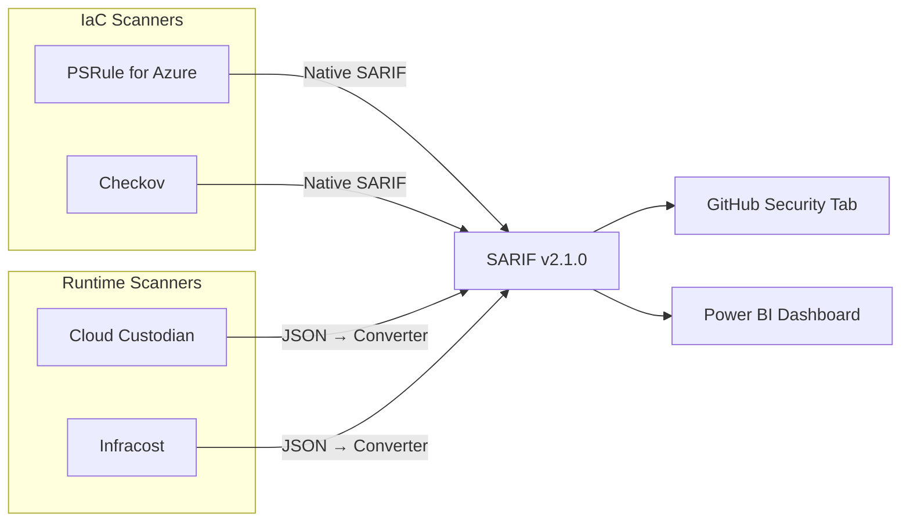

# FinOps Cost Governance Workshop

> [!NOTE]
> This workshop is part of the [Agentic Accelerator Framework](https://github.com/devopsabcs-engineering/agentic-accelerator-framework).

Learn to scan Azure infrastructure for cost governance violations using four open-source tools—PSRule, Checkov, Cloud Custodian, and Infracost—producing SARIF output for GitHub Security tab integration.

## Architecture

## Labs

| Lab | Title | Duration | Level |
|-----|-------|----------|-------|
| 00 | [Prerequisites and Environment Setup](labs/lab-00-setup.md) | 30 min | Beginner |
| 01 | [Explore the Demo Apps and FinOps Violations](labs/lab-01.md) | 25 min | Beginner |
| 02 | [PSRule — Infrastructure as Code Analysis](labs/lab-02.md) | 35 min | Intermediate |
| 03 | [Checkov — Static Policy Scanning](labs/lab-03.md) | 30 min | Intermediate |
| 04 | [Cloud Custodian — Runtime Resource Scanning](labs/lab-04.md) | 40 min | Intermediate |
| 05 | [Infracost — Cost Estimation and Budgeting](labs/lab-05.md) | 35 min | Intermediate |
| 06 | [SARIF Output and GitHub Security Tab](labs/lab-06.md) | 30 min | Intermediate |
| 07 | [GitHub Actions Pipelines and Cost Gates](labs/lab-07.md) | 45 min | Advanced |

## Tool Stack

| Tool | Focus | SARIF Output | License |
|------|-------|-------------|---------|
| PSRule for Azure | WAF Cost Optimization rules on Bicep/ARM | Native | MIT |
| Checkov | 1,000+ multi-cloud IaC policies | Native | Apache 2.0 |
| Cloud Custodian | Orphans, tagging, right-sizing on live resources | Converted | Apache 2.0 |
| Infracost | Pre-deployment cost estimates | Converted | Apache 2.0 |

## Prerequisites

- **GitHub account** with access to create repositories
- **Azure subscription** (required for Labs 04, 05, 07; free tier works)
- **VS Code** with the Bicep and PowerShell extensions
- Azure CLI, GitHub CLI, PowerShell 7+
- PSRule, Checkov, Cloud Custodian, and Infracost (installed during Lab 00)

## Quick Start

1. Click **[Use this template](https://github.com/devopsabcs-engineering/finops-scan-workshop/generate)** to create your own copy.
2. Install the prerequisite tools by following [Lab 00](labs/lab-00-setup.md).
3. Start with [Lab 01](labs/lab-01.md) to explore the demo apps.

## Delivery Tiers

| Tier | Labs | Duration | Azure Required |
|------|------|----------|---------------|
| Half-Day | 00, 01, 02, 03, 06 | ~3.5 hours | No |
| Full-Day | 00–07 (all) | ~7.25 hours | Yes |

## Contributing

See [CONTRIBUTING.md](CONTRIBUTING.md) for guidelines on contributing labs, fixing issues, and submitting pull requests.

## License

This project is licensed under the [MIT License](LICENSE).
