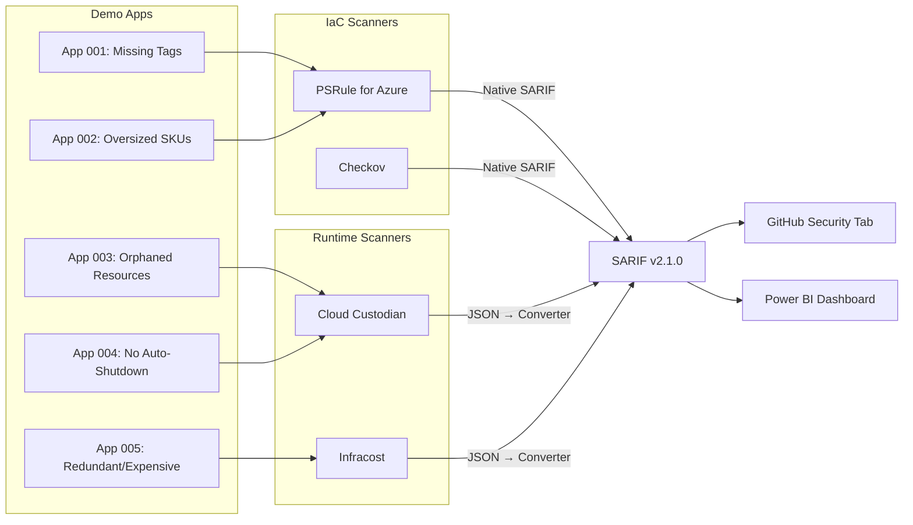
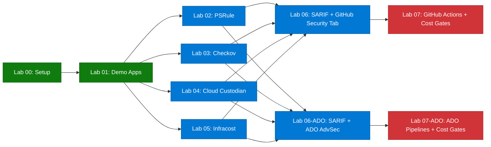

  

# Atelier de gouvernance des coûts FinOps

> 🇬🇧 **[English version](../)**

Bienvenue dans l'**Atelier de gouvernance des coûts FinOps** — un atelier pratique et progressif qui vous apprend à analyser l'infrastructure Azure pour détecter les violations de gouvernance des coûts à l'aide de quatre outils open source : PSRule, Checkov, Cloud Custodian et Infracost.

Tous les résultats sont normalisés au format [SARIF v2.1.0](https://docs.oasis-open.org/sarif/sarif/v2.1.0/sarif-v2.1.0.html) pour un reporting unifié dans GitHub Advanced Security ou Azure DevOps Advanced Security.

> [!NOTE]
> Cet atelier fait partie de l'[Agentic Accelerator Framework](https://github.com/devopsabcs-engineering/agentic-accelerator-framework).

## Architecture

## Pile technologique

| Outil | Domaine | Sortie SARIF | Licence |
|-------|---------|--------------|---------|
| PSRule for Azure | Règles d'optimisation des coûts WAF sur Bicep/ARM | Native | MIT |
| Checkov | Plus de 1 000 politiques IaC multi-cloud | Native | Apache 2.0 |
| Cloud Custodian | Ressources orphelines, étiquetage, dimensionnement sur ressources actives | Convertie | Apache 2.0 |
| Infracost | Estimations des coûts avant déploiement | Convertie | Apache 2.0 |

## Prérequis

- **Compte GitHub** avec accès pour créer des dépôts
- **Abonnement Azure** (requis pour les Labs 04, 05, 07 ; le niveau gratuit fonctionne)
- **VS Code** avec les extensions Bicep et PowerShell
- **Outils** (installés durant le Lab 00) :
  - Azure CLI
  - GitHub CLI
  - PowerShell 7+
  - PSRule et le module PSRule.Rules.Azure
  - Checkov (`pip install checkov`)
  - Cloud Custodian (`pip install c7n c7n-azure`)
  - Infracost CLI

Voir le [Lab 00 : Prérequis](labs/lab-00-setup.md) pour les instructions d'installation détaillées.

## Labs

| # | Lab | Durée | Niveau |
|---|-----|-------|--------|
| 00 | [Prérequis](labs/lab-00-setup.md) | 30 min | Débutant |
| 01 | [Explorer les applications de démonstration](labs/lab-01.md) | 25 min | Débutant |
| 02 | [PSRule](labs/lab-02.md) | 35 min | Intermédiaire |
| 03 | [Checkov](labs/lab-03.md) | 30 min | Intermédiaire |
| 04 | [Cloud Custodian](labs/lab-04.md) | 40 min | Intermédiaire |
| 05 | [Infracost](labs/lab-05.md) | 35 min | Intermédiaire |
| 06 | [SARIF + Onglet Sécurité GitHub](labs/lab-06.md) | 30 min | Intermédiaire |
| 06-ADO | [SARIF + ADO Advanced Security](labs/lab-06-ado.md) | 35 min | Intermédiaire |
| 07 | [GitHub Actions + Contrôles de coûts](labs/lab-07.md) | 45 min | Avancé |
| 07-ADO | [Pipelines ADO + Contrôles de coûts](labs/lab-07-ado.md) | 50 min | Avancé |

## Programme de l'atelier

### Demi-journée (3,5 heures)

| Heure | Activité |
|-------|----------|
| 0:00 – 0:30 | Lab 00 : Prérequis |
| 0:30 – 0:55 | Lab 01 : Explorer les applications de démonstration |
| 0:55 – 1:30 | Lab 02 : PSRule |
| 1:30 – 2:00 | Lab 03 : Checkov |
| 2:00 – 2:15 | Pause |
| 2:15 – 2:45 | Lab 06 : SARIF + Onglet Sécurité GitHub (ou Lab 06-ADO) |

### Journée complète (7 heures)

| Heure | Activité |
|-------|----------|
| 0:00 – 0:30 | Lab 00 : Prérequis |
| 0:30 – 0:55 | Lab 01 : Explorer les applications de démonstration |
| 0:55 – 1:30 | Lab 02 : PSRule |
| 1:30 – 2:00 | Lab 03 : Checkov |
| 2:00 – 2:40 | Lab 04 : Cloud Custodian |
| 2:40 – 2:55 | Pause |
| 2:55 – 3:30 | Lab 05 : Infracost |
| 3:30 – 4:00 | Lab 06 : SARIF + Onglet Sécurité GitHub |
| 4:00 – 4:35 | Lab 06-ADO : SARIF + ADO Advanced Security |
| 4:35 – 4:50 | Pause |
| 4:50 – 5:35 | Lab 07 : GitHub Actions + Contrôles de coûts |
| 5:35 – 6:25 | Lab 07-ADO : Pipelines ADO + Contrôles de coûts |

## Diagramme de dépendance des labs

## Niveaux de formation

| Niveau | Plateforme | Labs | Durée | Azure requis |
|--------|------------|------|-------|--------------|
| Demi-journée (GitHub) | GitHub | 00, 01, 02, 03, 06 | ~3,5 heures | Non |
| Demi-journée (ADO) | ADO | 00, 01, 02, 03, 06-ADO | ~3,5 heures | Non |
| Journée complète (GitHub) | GitHub | 00–07 (tous GitHub) | ~7,25 heures | Oui |
| Journée complète (ADO) | ADO | 00–05, 06-ADO, 07-ADO | ~7,75 heures | Oui |
| Journée complète (Double) | Les deux | 00–05, 06, 06-ADO, 07, 07-ADO | ~9,25 heures | Oui |

## Pour commencer

1. **Dupliquez (fork) ou utilisez ce modèle** pour créer votre propre instance de l'atelier.
2. Complétez le [Lab 00 : Prérequis](labs/lab-00-setup.md) pour configurer votre environnement.
3. Suivez les labs dans l'ordre — chaque lab s'appuie sur le précédent.

> **Astuce** : Cet atelier est conçu pour GitHub Codespaces. Cliquez sur **Code → Codespaces → New codespace** pour obtenir un environnement préconfiguré avec tous les outils installés.

## Dépôts associés

| Dépôt | Description |
|-------|-------------|
| [Agentic Accelerator Framework](https://github.com/devopsabcs-engineering/agentic-accelerator-framework) | Définitions d'agents, instructions, compétences et workflows CI/CD |
| [Agentic Accelerator Workshop](https://devopsabcs-engineering.github.io/agentic-accelerator-workshop/) | Atelier pratique pour les agents Accelerator alimentés par l'IA |
| [Accessibility Scan Workshop](https://devopsabcs-engineering.github.io/accessibility-scan-workshop/) | Atelier d'analyse d'accessibilité WCAG 2.2 |
| [Code Quality Scan Workshop](https://devopsabcs-engineering.github.io/code-quality-scan-workshop/) | Atelier d'analyse de la qualité du code |

## Licence

Ce projet est sous licence [MIT License](LICENSE).
