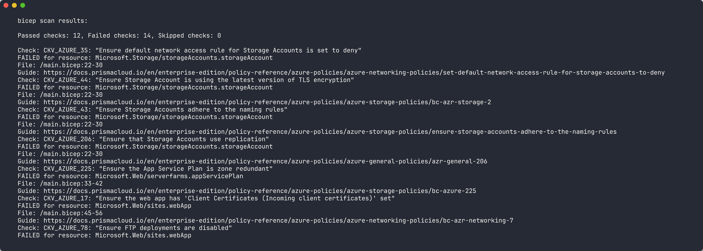
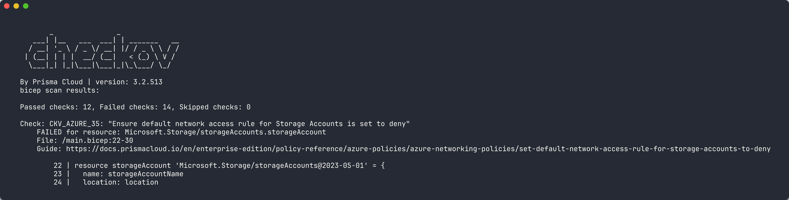
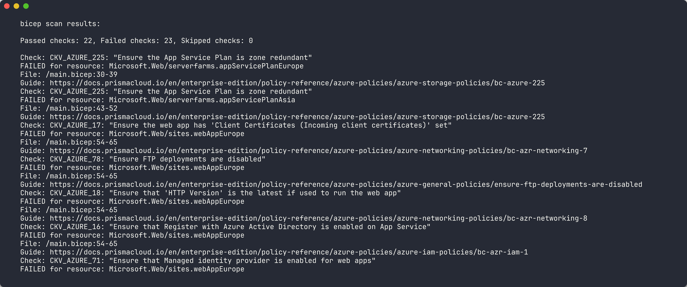
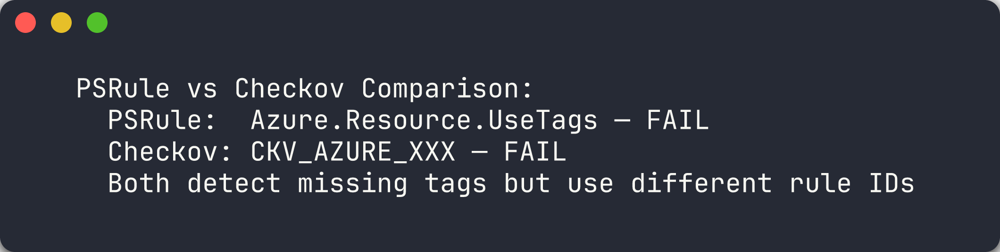

## Aperçu

| | |
|---|---|
| **Durée** | 30 minutes |
| **Niveau** | Intermédiaire |
| **Prérequis** | [Lab 01](lab-01.md) |

## Objectifs d'apprentissage

À la fin de ce lab, vous serez capable de :

* Exécuter Checkov sur des templates Bicep via le CLI
* Interpréter la sortie de Checkov incluant les vérifications réussies, échouées et ignorées
* Exporter les résultats de Checkov au format SARIF pour l'intégration avec l'onglet Sécurité GitHub
* Comparer les résultats de Checkov avec ceux de PSRule pour le même template

## Exercices

### Exercice 3.1 : Exécuter Checkov sur l'application 001

Vous allez analyser l'application sans étiquettes avec Checkov et générer une sortie SARIF.

1. Créez le répertoire de rapports s'il n'existe pas :

   ```bash
   mkdir -p reports
   ```

2. Exécutez Checkov sur l'application 001 avec une sortie console et SARIF :

   ```bash
   checkov -d finops-demo-app-001/infra/ --output cli --output sarif --output-file-path console,reports/
   ```

   Cela produit une sortie CLI à l'écran et écrit un fichier SARIF dans le répertoire `reports/`.

3. Examinez la sortie CLI. Checkov résume les résultats en trois catégories :
   - **Passed** (réussi) — vérifications satisfaites par le template
   - **Failed** (échoué) — vérifications violées par le template
   - **Skipped** (ignoré) — vérifications exclues par la configuration

4. Notez les identifiants des vérifications échouées. Checkov utilise des identifiants au format `CKV_AZURE_*` (par exemple, `CKV_AZURE_18` pour les règles réseau du compte de stockage).



> [!TIP]
> Checkov analyse les violations de **sécurité** et de **bonnes pratiques**. Vous verrez des vérifications liées à l'application de HTTPS, la version TLS, les clés d'accès et la configuration réseau — pas uniquement la gouvernance des coûts. Cette couverture élargie complète le focus spécifique Azure de PSRule.

### Exercice 3.2 : Examiner les résultats de Checkov

Vous allez analyser les résultats de Checkov pour comprendre la signification de chaque résultat.

1. Ouvrez le fichier SARIF généré par Checkov dans le répertoire `reports/`.

2. Examinez le tableau `results`. Chaque entrée contient :
   - **`ruleId`** — l'identifiant de vérification Checkov (par exemple, `CKV_AZURE_18`)
   - **`level`** — sévérité du résultat
   - **`message.text`** — description de la vérification échouée
   - **`locations`** — chemin du fichier et référence de la ressource

3. Classez les résultats par groupes :

   | Catégorie | Exemples d'identifiants | Description |
   |-----------|------------------------|-------------|
   | Sécurité réseau | `CKV_AZURE_18`, `CKV_AZURE_59` | Règles réseau du compte de stockage, HTTPS uniquement |
   | Chiffrement | `CKV_AZURE_33`, `CKV_AZURE_43` | Chiffrement au repos, version TLS |
   | Contrôle d'accès | `CKV_AZURE_36` | Clé d'accès partagée désactivée |
   | Surveillance | `CKV_AZURE_65` | Messages d'erreur détaillés App Service |

4. Notez que Checkov ne vérifie pas explicitement les 7 étiquettes de gouvernance comme le fait PSRule. C'est une différence clé entre les outils.



> [!IMPORTANT]
> Les identifiants et descriptions des vérifications Checkov peuvent varier entre les versions. Utilisez `checkov --list` pour voir toutes les vérifications disponibles pour le framework `arm`.

### Exercice 3.3 : Exécuter Checkov sur l'application 005

Vous allez analyser l'application avec des ressources redondantes/coûteuses et rechercher des résultats supplémentaires.

1. Exécutez Checkov sur l'application 005 :

   ```bash
   checkov -d finops-demo-app-005/infra/ --output cli --output sarif --output-file-path console,reports/
   ```

2. Comparez la sortie avec l'analyse de l'application 001. L'application 005 a :
   - **2 App Service Plans** déployés dans des régions non approuvées (`westus` et `westeurope`)
   - **Stockage GRS (géo-redondant)** pour une charge de travail de développement
   - Les 7 étiquettes de gouvernance présentes

3. Vérifiez si Checkov signale :
   - Les App Service Plans en double
   - Le niveau de stockage GRS comme excessivement coûteux
   - Des violations liées aux régions

4. Notez quelles violations Checkov **détecte** par rapport à celles qu'il **manque**. Cet écart justifie l'utilisation de plusieurs outils d'analyse.



### Exercice 3.4 : Comparer avec PSRule

Vous allez créer une comparaison côte à côte pour comprendre les forces de chaque outil.

1. Si vous avez terminé le Lab 02, ouvrez les résultats SARIF de PSRule pour les applications 001 et 005.
2. Si vous n'avez pas terminé le Lab 02, exécutez PSRule maintenant (référez-vous au Lab 02, Exercice 2.2 pour la commande).
3. Construisez un tableau comparatif basé sur vos résultats :

   | Aspect | PSRule | Checkov |
   |--------|--------|---------|
   | **Domaine** | Bonnes pratiques Azure, étiquetage, nommage | Sécurité, conformité, benchmarks CIS |
   | **Vérif. étiquettes** | Règle explicite `Azure.Resource.UseTags` | Pas de vérification dédiée de gouvernance des étiquettes |
   | **Vérif. régions** | Configuration `AZURE_RESOURCE_ALLOWED_LOCATIONS` | Conscience limitée des régions |
   | **Vérif. SKU** | Quelques règles pour les bonnes pratiques de dimensionnement | Vérifications pour des configurations de services spécifiques |
   | **Format de sortie** | SARIF, CSV, JSON | SARIF, JSON, JUnit, CSV |
   | **Support langages** | Bicep (via décompilation), ARM JSON | ARM JSON, Bicep, Terraform |
   | **Règles personnalisées** | Règles personnalisées basées sur PowerShell | Vérifications personnalisées basées sur Python |

4. Résumez votre observation clé : **PSRule excelle dans la gouvernance spécifique Azure (étiquettes, régions, nommage) tandis que Checkov excelle dans la sécurité et la conformité (chiffrement, règles réseau, benchmarks CIS)**. L'utilisation des deux outils ensemble fournit une couverture complète.



> [!TIP]
> Dans un pipeline d'analyse FinOps en production, vous exécutez **tous** les outils d'analyse en parallèle et fusionnez les résultats SARIF. Les Labs 06 et 07 couvrent exactement ce schéma avec GitHub Actions.

## Point de vérification

Avant de continuer, vérifiez :

* [ ] L'analyse Checkov s'est terminée avec succès sur au moins 2 applications de démonstration
* [ ] La sortie SARIF a été générée par Checkov dans le répertoire `reports/`
* [ ] Pouvez expliquer au moins 3 identifiants de vérification Checkov et ce qu'ils détectent
* [ ] Avez documenté le chevauchement et les lacunes entre Checkov et PSRule

## Étapes suivantes

Passez au [Lab 04 — Cloud Custodian : Analyse des ressources en temps réel](lab-04.md).
