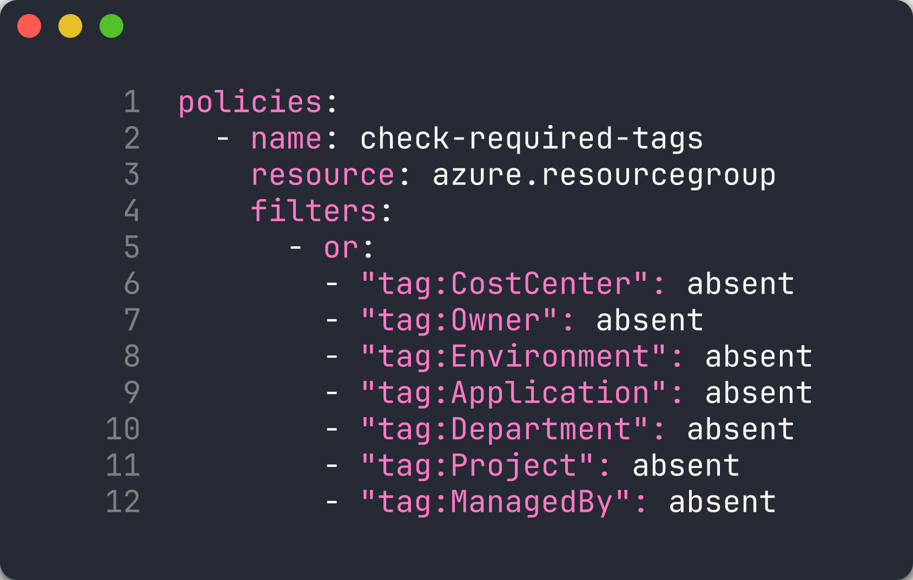
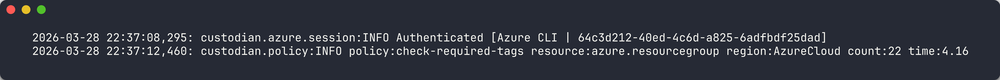
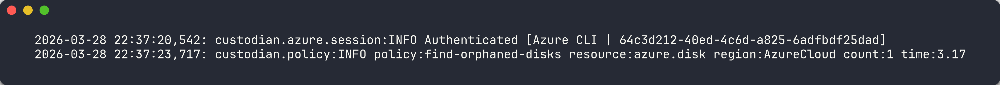
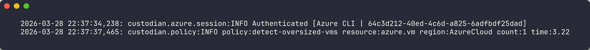
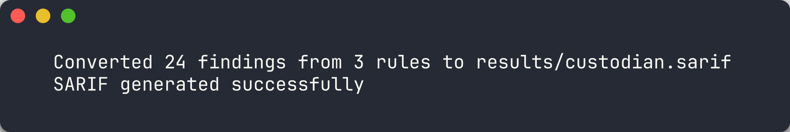

## Aperçu

| | |
|---|---|
| **Durée** | 40 minutes |
| **Niveau** | Intermédiaire |
| **Prérequis** | [Lab 01](lab-01.md) |

> [!IMPORTANT]
> Ce lab nécessite des ressources Azure déployées. Assurez-vous qu'au moins les applications 001, 003 et 004 sont déployées avant de commencer. Si vous ne les avez pas déployées, retournez au Lab 00, Exercice 0.5.

## Objectifs d'apprentissage

À la fin de ce lab, vous serez capable de :

* Installer et configurer Cloud Custodian avec le fournisseur `c7n-azure`
* Examiner les politiques Cloud Custodian pour l'étiquetage, la détection d'orphelins, le dimensionnement et les ressources inactives
* Exécuter des analyses Cloud Custodian sur des ressources Azure actives
* Convertir la sortie JSON de Cloud Custodian en SARIF à l'aide du convertisseur `custodian-to-sarif.py`

## Exercices

### Exercice 4.1 : Examiner les politiques Custodian

Vous allez parcourir les 4 fichiers de politiques dans `src/config/custodian/` pour comprendre ce que chacun détecte.

1. Ouvrez le répertoire `src/config/custodian/` et examinez les fichiers de politiques listés ci-dessous.

2. Chaque fichier de politique Cloud Custodian suit la même structure :

   ```yaml
   policies:
     - name: policy-name        # Unique name for this rule
       resource: azure.type     # Azure resource type to scan
       filters:                 # Conditions that flag a violation
         - type: value
           key: properties.field
           value: some-value
   ```

3. Examinez le tableau de référence des politiques ci-dessous. Chaque ligne associe un fichier de politique à la ressource qu'il analyse et à la violation qu'il détecte :

   | Fichier de politique | Nom de la politique | Ressource cible | Violation détectée |
   |---|---|---|---|
   | `tagging-compliance.yml` | `check-required-tags` | `azure.resourcegroup` | Étiquettes de gouvernance manquantes |
   | `orphan-detection.yml` | `find-orphaned-disks` | `azure.disk` | `diskState == Unattached` |
   | `orphan-detection.yml` | `find-orphaned-nics` | `azure.networkinterface` | `virtualMachine == null` |
   | `orphan-detection.yml` | `find-orphaned-public-ips` | `azure.publicip` | `ipConfiguration == null` |
   | `right-sizing.yml` | `detect-oversized-vms` | `azure.vm` | VMs D4s+ en dev/test |
   | `right-sizing.yml` | `detect-oversized-plans` | `azure.appserviceplan` | Plans P-tier/S3 en dev/test |
   | `idle-resources.yml` | `detect-no-autoshutdown` | `azure.vm` | VMs dev/test non désallouées |

4. Ouvrez `src/config/custodian/tagging-compliance.yml` et examinez comment le filtre `or` vérifie l'absence de l'une des 7 étiquettes de gouvernance requises :

   ```yaml
   policies:
     - name: check-required-tags
       resource: azure.resourcegroup
       filters:
         - or:
           - "tag:CostCenter": absent
           - "tag:Owner": absent
           - "tag:Environment": absent
           - "tag:Application": absent
           - "tag:Department": absent
           - "tag:Project": absent
           - "tag:ManagedBy": absent
   ```

5. Ouvrez `src/config/custodian/orphan-detection.yml` et notez comment chaque politique cible un type de ressource Azure différent. La politique `find-orphaned-disks` recherche les disques avec `diskState == Unattached`, tandis que `find-orphaned-nics` vérifie les cartes réseau où `virtualMachine == null`.

6. Ouvrez `src/config/custodian/right-sizing.yml` et observez le schéma à deux filtres : le premier filtre correspond aux SKU surdimensionnés (D4s+, P-tier, S3), et le second filtre restreint aux environnements dev/test en utilisant l'étiquette `Environment`.

7. Ouvrez `src/config/custodian/idle-resources.yml` et examinez comment il détecte les VMs en dev/test qui ne sont pas désallouées.



> [!TIP]
> Les politiques Cloud Custodian sont du YAML déclaratif. Contrairement à PSRule et Checkov qui analysent les fichiers IaC, Cloud Custodian interroge les **ressources Azure actives** via l'API Azure Resource Manager. Cela signifie qu'il détecte les violations qui n'apparaissent qu'en temps réel — comme les ressources orphelines créées en dehors de l'IaC.

### Exercice 4.2 : Exécuter la conformité d'étiquetage

Vous allez exécuter la politique de conformité d'étiquetage sur vos ressources Azure déployées.

1. Créez le répertoire de sortie :

   ```bash
   mkdir -p output
   ```

2. Exécutez l'analyse de conformité d'étiquetage :

   ```bash
   custodian run -s output/ src/config/custodian/tagging-compliance.yml --cache-period 0
   ```

   Le drapeau `-s output/` définit le répertoire de sortie. Le drapeau `--cache-period 0` désactive la mise en cache pour obtenir toujours des résultats frais.

3. Examinez la sortie de l'analyse. Cloud Custodian rapporte le nombre de ressources correspondant à chaque politique.

4. Vérifiez le fichier de sortie JSON :

   ```bash
   cat output/check-required-tags/resources.json
   ```

   Chaque entrée dans le tableau est un groupe de ressources Azure qui manque au moins une des 7 étiquettes de gouvernance requises. L'application 001 déploie des ressources avec **zéro étiquette**, donc son groupe de ressources devrait apparaître.



> [!NOTE]
> Cloud Custodian crée un sous-répertoire sous `output/` nommé d'après la politique (par exemple, `output/check-required-tags/`). Chaque sous-répertoire contient un fichier `resources.json` avec les ressources correspondantes et des fichiers de métadonnées optionnels.

### Exercice 4.3 : Exécuter la détection d'orphelins

Vous allez rechercher les ressources orphelines qui génèrent des coûts mais ne sont attachées à aucune charge de travail.

1. Exécutez l'analyse de détection d'orphelins :

   ```bash
   custodian run -s output/ src/config/custodian/orphan-detection.yml --cache-period 0
   ```

2. Ce fichier de politique contient 3 politiques distinctes. Chacune crée son propre sous-répertoire de sortie :
   - `output/find-orphaned-disks/resources.json`
   - `output/find-orphaned-nics/resources.json`
   - `output/find-orphaned-public-ips/resources.json`

3. Examinez les résultats d'orphelins :

   ```bash
   cat output/find-orphaned-disks/resources.json
   cat output/find-orphaned-nics/resources.json
   cat output/find-orphaned-public-ips/resources.json
   ```

4. L'application 003 déploie des IP publiques, des cartes réseau, des disques managés et des NSG non attachés. Vous devriez voir des résultats provenant du groupe de ressources de cette application dans la sortie.



> [!IMPORTANT]
> Les ressources orphelines sont l'une des sources les plus courantes de gaspillage cloud. Un seul disque managé non attaché peut coûter entre 5 et 75 $ par mois selon le niveau et la taille. Cloud Custodian peut les détecter automatiquement selon un calendrier.

### Exercice 4.4 : Exécuter le dimensionnement

Vous allez rechercher les ressources surdimensionnées dans les environnements de développement et de test.

1. Exécutez l'analyse de dimensionnement :

   ```bash
   custodian run -s output/ src/config/custodian/right-sizing.yml --cache-period 0
   ```

2. Examinez les fichiers de sortie :

   ```bash
   cat output/detect-oversized-vms/resources.json
   cat output/detect-oversized-plans/resources.json
   ```

3. L'application 002 déploie un App Service Plan P3v3 pour une charge de travail de développement. La politique `detect-oversized-plans` devrait signaler cela comme une violation car les plans P-tier sont excessifs pour les environnements dev/test.

4. L'application 004 déploie une VM D4s_v5. La politique `detect-oversized-vms` devrait la signaler si le groupe de ressources a une étiquette `Environment` dev/test.



> [!TIP]
> Les politiques de dimensionnement fonctionnent mieux lorsque vous appliquez un étiquetage d'environnement cohérent. Les politiques de cet atelier ne signalent que les ressources surdimensionnées dans les environnements étiquetés `Development`, `Dev` ou `Test`. Les ressources de production sont exclues par conception.

### Exercice 4.5 : Convertir en SARIF

Vous allez convertir la sortie JSON de Cloud Custodian au format SARIF pour le téléversement vers l'onglet Sécurité GitHub.

1. Créez le répertoire de rapports :

   ```bash
   mkdir -p reports
   ```

2. Exécutez le convertisseur SARIF :

   ```bash
   python src/converters/custodian-to-sarif.py output/ reports/custodian.sarif --resource-group rg-finops-demo-001
   ```

   Le drapeau `--resource-group` filtre les résultats pour n'afficher que les ressources appartenant au groupe de ressources spécifié. Dans le pipeline automatisé, chaque tâche de la matrice passe son propre nom de groupe de ressources.

3. Ouvrez le fichier SARIF généré et inspectez sa structure :

   ```bash
   cat reports/custodian.sarif
   ```

4. Vérifiez que le fichier SARIF contient :
   - Une section `tool.driver` avec `name: "custodian-to-sarif"`
   - Un tableau `rules` associant les noms de politiques Cloud Custodian aux identifiants de règles SARIF
   - Un tableau `results` avec des résultats incluant `physicalLocation` pointant vers `infra/main.bicep`

5. Essayez de convertir avec un autre groupe de ressources et comparez la sortie :

   ```bash
   python src/converters/custodian-to-sarif.py output/ reports/custodian-003.sarif --resource-group rg-finops-demo-003
   ```



> [!NOTE]
> Le convertisseur `custodian-to-sarif.py` ajoute `physicalLocation` avec `artifactLocation` pointant vers `infra/main.bicep`. C'est requis par GitHub Code Scanning — la spécification SARIF autorise les emplacements uniquement logiques, mais GitHub rejette les SARIF sans chemin de fichier physique.

## Point de vérification

Avant de continuer, vérifiez :

* [ ] Cloud Custodian a exécuté au moins 2 politiques avec succès
* [ ] La sortie JSON a été générée dans le répertoire `output/` avec les ressources correspondantes
* [ ] Le fichier SARIF a été généré par `custodian-to-sarif.py` avec une structure valide
* [ ] Pouvez expliquer la structure des politiques Cloud Custodian et la syntaxe des filtres

## Étapes suivantes

Passez au [Lab 05 — Infracost : Estimation des coûts et budgétisation](lab-05.md).
