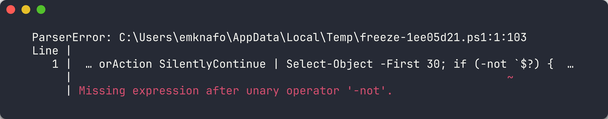
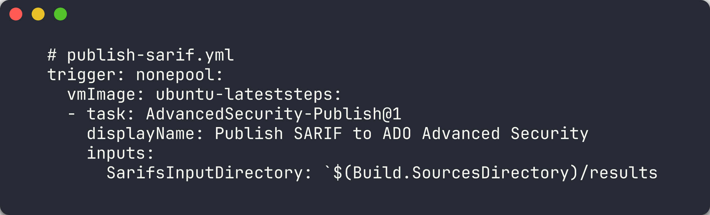
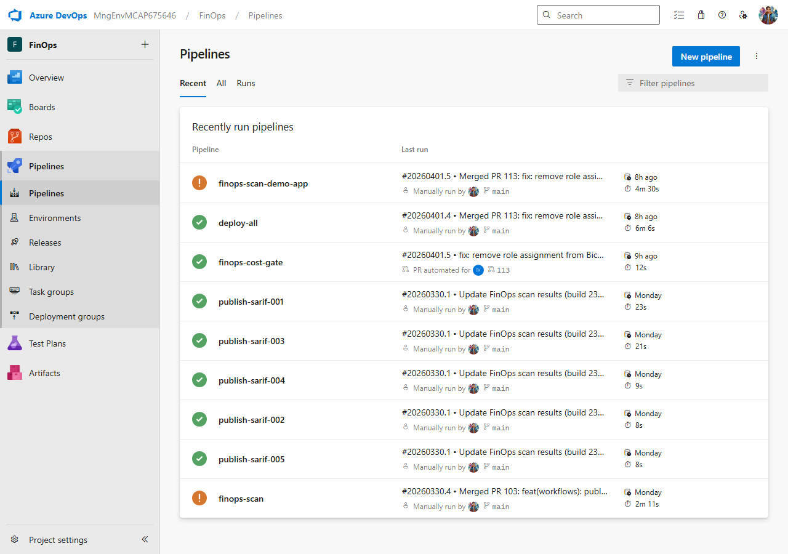
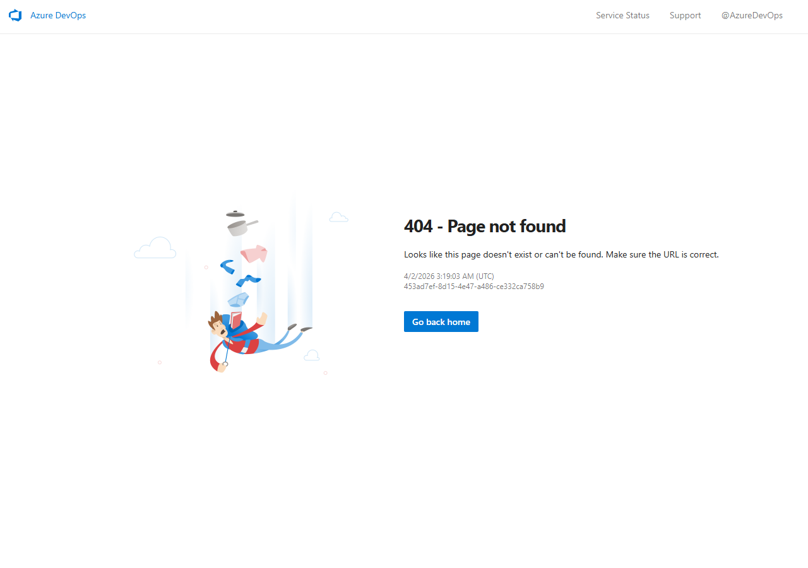
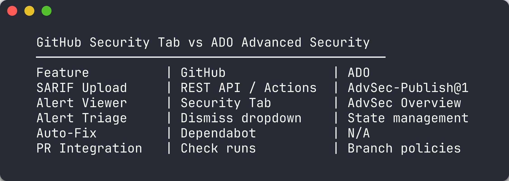

## Aperçu

| | |
|---|---|
| **Durée** | 35 minutes |
| **Niveau** | Intermédiaire |
| **Prérequis** | [Lab 02](lab-02.md), [Lab 03](lab-03.md), [Lab 04](lab-04.md) ou [Lab 05](lab-05.md) (au moins un) |

## Objectifs d'apprentissage

À la fin de ce lab, vous serez capable de :

* Expliquer comment ADO Advanced Security (GHAzDO) ingère les résultats SARIF
* Activer Advanced Security au niveau du projet et du dépôt
* Créer un pipeline YAML ADO avec `AdvancedSecurity-Publish@1`
* Visualiser et trier les résultats dans l'aperçu ADO Advanced Security
* Comparer l'onglet Sécurité GitHub avec ADO Advanced Security

## Exercices

### Exercice 6.1 : Examiner la sortie SARIF

Vous allez examiner le format SARIF v2.1.0 que les quatre outils d'analyse produisent.

> [!NOTE]
> Cet exercice partage les fondements avec le Lab 06 (variante GitHub). Complétez l'[Exercice 6.1 du Lab 06](lab-06.md#exercice-61--exploration-approfondie-du-schéma-sarif) si vous ne l'avez pas déjà fait. Ce qui suit est un bref rappel pour le parcours ADO.

1. Ouvrez n'importe quel fichier SARIF que vous avez généré dans un lab précédent (par exemple, `reports/psrule-001.sarif` ou `reports/custodian.sarif`).

2. Rappelez-vous les quatre sections principales du SARIF :

   | Section | Objectif |
   |---------|----------|
   | `version` / `$schema` | Déclare la conformité SARIF v2.1.0 |
   | `runs[].tool.driver` | Identifie l'outil d'analyse, la version et les définitions de règles |
   | `runs[].tool.driver.rules[]` | Définit les identifiants de règles, les descriptions, la sévérité et les URL d'aide |
   | `runs[].results[]` | Contient les résultats individuels avec l'identifiant de règle, la sévérité, le message et l'emplacement |

3. Notez comment `physicalLocation` lie un résultat à un fichier et un numéro de ligne spécifiques. ADO Advanced Security utilise ces données d'emplacement pour afficher les résultats dans l'aperçu de sécurité et les lier aux fichiers source.

4. Vérifiez que votre fichier SARIF inclut au moins un résultat avec un `ruleId`, un `level`, un `message` et un tableau `locations`. ADO Advanced Security a besoin de ces champs pour afficher correctement les alertes.



> [!TIP]
> SARIF (Static Analysis Results Interchange Format) est un standard OASIS. GitHub et Azure DevOps Advanced Security consomment tous deux des fichiers SARIF, donc produire du SARIF à partir des 4 outils vous donne une vue unifiée quelle que soit la plateforme que vous utilisez.

### Exercice 6.2 : Activer ADO Advanced Security

Vous allez activer Advanced Security (GHAzDO) dans le projet `MngEnvMCAP675646/FinOps`.

> [!IMPORTANT]
> ADO Advanced Security nécessite une licence appropriée. Votre organisation doit avoir GitHub Advanced Security for Azure DevOps (GHAzDO) activé. Contactez l'administrateur de votre organisation si le bouton n'est pas disponible.

1. Ouvrez Azure DevOps et naviguez vers l'organisation `MngEnvMCAP675646`.

2. Sélectionnez le projet **FinOps**.

3. Cliquez sur **Project Settings** (icône d'engrenage en bas à gauche).

4. Sous **Repos**, cliquez sur **Repositories**.

5. Sélectionnez le dépôt où vous souhaitez activer Advanced Security (par exemple, `finops-demo-app-001`).

6. Cliquez sur l'onglet **Settings** du dépôt.

7. Faites défiler jusqu'à la section **Advanced Security** et basculez sur **On**.

8. Répétez pour chaque dépôt qui doit rapporter des résultats SARIF. Vous pouvez également l'activer au niveau du projet pour couvrir tous les dépôts :
   - Retournez dans **Project Settings → Repos → Repositories**
   - Cliquez sur **Settings** au niveau du projet
   - Basculez **Advanced Security** sur **On** pour tous les dépôts

9. Vérifiez que le bouton est actif. Vous devriez voir un message de confirmation indiquant que Advanced Security est activé.

> [!NOTE]
> Activer Advanced Security au niveau du projet l'active automatiquement pour tous les dépôts actuels et futurs du projet. Les paramètres par dépôt remplacent la valeur par défaut du projet si vous devez exclure des dépôts spécifiques.

### Exercice 6.3 : Créer le pipeline de publication SARIF

Vous allez créer un pipeline YAML ADO qui téléverse les résultats SARIF vers Advanced Security en utilisant la tâche `AdvancedSecurity-Publish@1`.

1. Dans votre dépôt, créez le fichier pipeline à `.azuredevops/pipelines/publish-sarif.yml` :

   ```yaml
   trigger: none

   pool:
     vmImage: 'ubuntu-latest'

   steps:
     - task: AdvancedSecurity-Publish@1
       displayName: 'Publish SARIF to ADO Advanced Security'
       inputs:
         SarifsInputDirectory: '$(Build.SourcesDirectory)/results'
   ```

2. Le pipeline utilise `trigger: none` pour qu'il ne s'exécute que sur déclenchement manuel ou lorsqu'il est appelé depuis un autre pipeline.

3. La tâche `AdvancedSecurity-Publish@1` analyse le répertoire spécifié à la recherche de fichiers `.sarif` et les téléverse vers ADO Advanced Security. Placez vos fichiers SARIF dans le répertoire `results/` à la racine du dépôt.

4. Enregistrez le pipeline dans ADO :
   - Naviguez vers **Pipelines → Pipelines** dans le projet FinOps
   - Cliquez sur **New Pipeline**
   - Sélectionnez **Azure Repos Git** comme source
   - Sélectionnez le dépôt contenant le fichier YAML
   - Choisissez **Existing Azure Pipelines YAML file**
   - Définissez le chemin vers `.azuredevops/pipelines/publish-sarif.yml`
   - Cliquez sur **Save** (pas Run — vous l'exécuterez dans le prochain exercice)



> [!TIP]
> La tâche `AdvancedSecurity-Publish@1` est l'équivalent ADO de `github/codeql-action/upload-sarif@v4` de GitHub. Les deux consomment des fichiers SARIF, mais la tâche ADO publie directement vers le backend ADO Advanced Security plutôt que l'API GitHub Code Scanning.

### Exercice 6.4 : Exécuter le pipeline et téléverser les SARIF

Vous allez lancer le pipeline publish-sarif et téléverser les résultats SARIF vers ADO Advanced Security.

1. Assurez-vous d'avoir au moins un fichier `.sarif` dans le répertoire `results/` de votre dépôt. Vous pouvez copier un fichier d'un lab précédent :

   ```bash
   mkdir -p results
   cp reports/psrule-001.sarif results/
   git add results/
   git commit -m "chore: add SARIF results for ADO upload"
   git push
   ```

2. Lancez le pipeline depuis l'interface web ADO :
   - Naviguez vers **Pipelines → Pipelines**
   - Trouvez le pipeline **publish-sarif**
   - Cliquez sur **Run pipeline**
   - Sélectionnez la branche contenant vos fichiers SARIF
   - Cliquez sur **Run**

3. Sinon, déclenchez le pipeline depuis la ligne de commande :

   ```bash
   az pipelines run --name publish-sarif --organization https://dev.azure.com/MngEnvMCAP675646 --project FinOps
   ```

4. Surveillez l'exécution du pipeline. Cliquez sur le pipeline en cours d'exécution pour voir les journaux du job.

5. Vérifiez que l'étape `AdvancedSecurity-Publish@1` s'est terminée avec succès. Les journaux devraient montrer le nombre de fichiers SARIF traités et les résultats téléversés.



> [!NOTE]
> Si le pipeline échoue avec une erreur de permissions, vérifiez que Advanced Security est activé pour le dépôt (Exercice 6.2) et que le pipeline a les permissions requises pour publier les résultats de sécurité.

### Exercice 6.5 : Visualiser l'aperçu ADO Advanced Security

Vous allez naviguer vers l'aperçu ADO Advanced Security pour examiner les résultats téléversés.

1. Dans le projet FinOps, naviguez vers **Repos** dans la barre latérale gauche.

2. Cliquez sur **Advanced Security** pour ouvrir l'aperçu de sécurité.

3. Examinez le tableau de bord des résultats. Les résultats sont regroupés par :
   - **Sévérité** — Critical, High, Medium, Low
   - **Outil** — l'outil d'analyse qui a produit le résultat
   - **État** — Active, Dismissed

4. Cliquez sur une alerte individuelle pour voir la vue détaillée :
   - Identifiant et description de la règle
   - Niveau de sévérité
   - Emplacement du fichier source avec numéro de ligne
   - Horodatages de première détection et de dernière observation

5. Utilisez le menu déroulant **State** sur une alerte pour la trier :
   - **Active** — le résultat nécessite une attention
   - **Dismissed** — marqué comme faux positif ou ne sera pas corrigé

6. Utilisez les contrôles de filtre en haut pour affiner les résultats par sévérité, outil ou état.




> [!TIP]
> ADO Advanced Security conserve l'historique des alertes entre les exécutions de pipeline. Si vous corrigez une violation et relancez l'analyse, l'état de l'alerte passe automatiquement à **Fixed**. C'est similaire à la façon dont GitHub Code Scanning suit le cycle de vie des alertes entre les commits.

### Exercice 6.6 : Comparer GitHub vs ADO

Vous allez comparer l'expérience des alertes de sécurité sur les deux plateformes.

Examinez le tableau comparatif suivant :

| Fonctionnalité | GitHub | Azure DevOps |
|----------------|--------|--------------|
| Téléversement SARIF | API REST / `codeql-action/upload-sarif@v4` | `AdvancedSecurity-Publish@1` |
| Visualisation des alertes | Security Tab → Code Scanning | Repos → Advanced Security |
| Tri des alertes | Menu déroulant de rejet (faux positif, ne sera pas corrigé, utilisé dans les tests) | Gestion de l'état (Active, Dismissed) |
| Correction automatique | Dependabot / Copilot Autofix | Non disponible |
| Intégration PR | Check runs + status checks | Branch policies |
| Accès API | API REST Code Scanning | API REST ADO |

Différences clés à noter :

1. **Mécanisme de téléversement** — GitHub utilise une API REST avec encodage gzip+base64. ADO utilise une tâche de pipeline dédiée qui lit les fichiers SARIF depuis un répertoire.

2. **Granularité du tri** — GitHub offre trois raisons de rejet (faux positif, ne sera pas corrigé, utilisé dans les tests). ADO utilise un modèle d'état plus simple Active/Dismissed.

3. **Remédiation automatique** — GitHub a Dependabot et Copilot Autofix pour les corrections automatisées. ADO Advanced Security n'offre pas de suggestions de correction automatisées.

4. **Intégration PR** — GitHub utilise les check runs et les status checks. ADO utilise les branch policies qui peuvent conditionner la finalisation d'une PR aux résultats de sécurité.

5. **Les deux plateformes** consomment le même standard SARIF v2.1.0, vous pouvez donc utiliser la même sortie d'analyse pour les deux.



> [!IMPORTANT]
> Dans un environnement double plateforme, exécutez vos outils d'analyse une seule fois et téléversez la même sortie SARIF vers GitHub et ADO. Cela élimine les divergences de résultats et assure une gouvernance cohérente entre les plateformes.

## Point de vérification

Avant de continuer, vérifiez :

* [ ] Pouvez décrire comment ADO Advanced Security ingère les résultats SARIF
* [ ] Avez activé Advanced Security sur au moins un dépôt
* [ ] Avez créé et exécuté le pipeline publish-sarif avec succès
* [ ] Avez visualisé et trié les résultats dans l'aperçu ADO Advanced Security
* [ ] Pouvez articuler 3 différences entre l'onglet Sécurité GitHub et ADO Advanced Security

## Étapes suivantes

Continuez vers le [Lab 07-ADO — Pipelines YAML ADO et contrôles de coûts](lab-07-ado.md).

> [!NOTE]
> Pour la variante GitHub de ce lab, consultez le [Lab 06 — Sortie SARIF et onglet Sécurité GitHub](lab-06.md).
