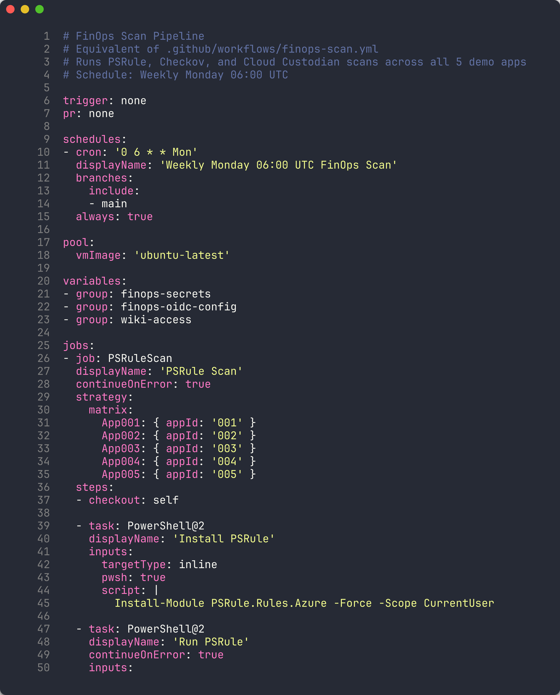
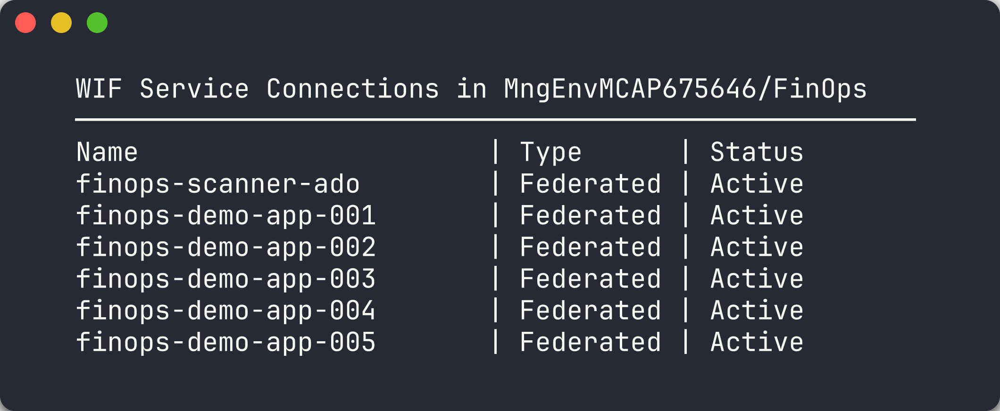
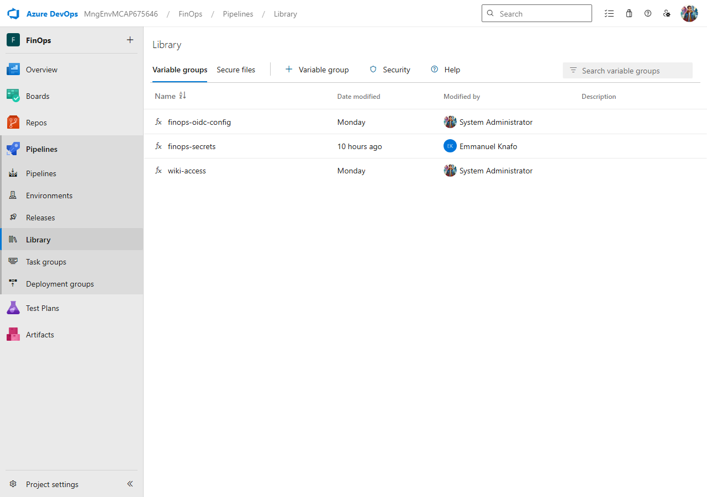
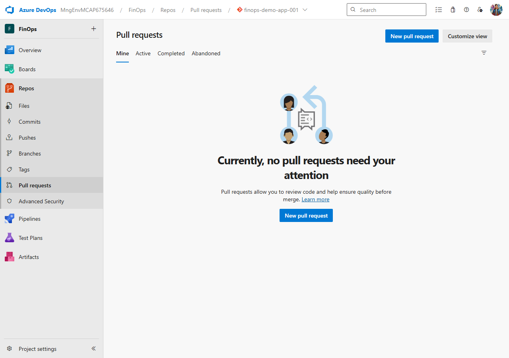
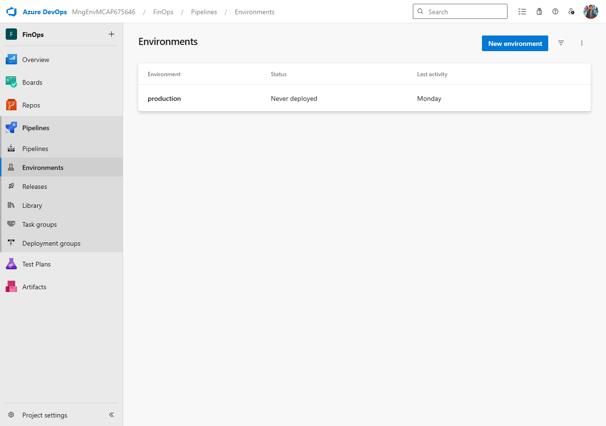
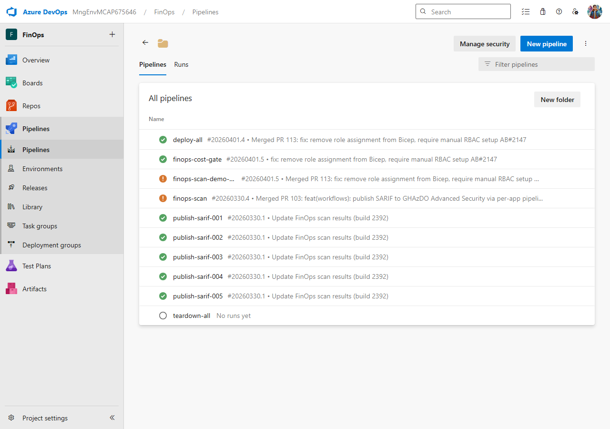

## Aperçu

| | |
|---|---|
| **Durée** | 50 minutes |
| **Niveau** | Avancé |
| **Prérequis** | [Lab 02](lab-02.md), [Lab 03](lab-03.md), [Lab 04](lab-04.md), [Lab 05](lab-05.md), [Lab 06-ADO](lab-06-ado.md) |

## Objectifs d'apprentissage

À la fin de ce lab, vous serez capable de :

* Construire un pipeline YAML ADO avec une stratégie de matrice pour l'analyse multi-applications
* Configurer les connexions de service avec fédération d'identité de charge de travail (WIF)
* Implémenter des groupes de variables pour une configuration centralisée
* Mettre en place des déclencheurs planifiés et des approbations d'environnement
* Créer des templates de pipeline pour la réutilisation
* Lier des éléments de travail avec la syntaxe `AB#`

## Exercices

### Exercice 7.1 : Examiner le pipeline d'analyse ADO

Vous allez parcourir le pipeline d'analyse centralisé qui exécute les 4 outils sur les 5 applications de démonstration.

1. Ouvrez `.azuredevops/pipelines/finops-scan.yml` et examinez l'architecture globale :

   ```text
   finops-scan.yml
   ├── Stage: Scan
   │   ├── Job: PSRule (strategy: matrix × 5 apps)
   │   ├── Job: Checkov (strategy: matrix × 5 apps)
   │   └── Job: Custodian (strategy: matrix × 5 apps)
   └── Stage: Upload
       └── Job: SARIF Upload (strategy: matrix × 5 apps)
   ```

2. Examinez la configuration des déclencheurs :

   ```yaml
   trigger: none

   schedules:
     - cron: '0 6 * * 1'
       displayName: 'Weekly Monday 06:00 UTC'
       branches:
         include:
           - main
   ```

   Le pipeline s'exécute selon un calendrier hebdomadaire et peut être déclenché manuellement. Contrairement au `workflow_dispatch` de GitHub Actions, les pipelines ADO avec `trigger: none` sont toujours disponibles pour des exécutions manuelles depuis l'interface ou le CLI.

3. Examinez la configuration du pool :

   ```yaml
   pool:
     vmImage: 'ubuntu-latest'
   ```

4. Examinez la section des variables. Le pipeline référence des groupes de variables partagés :

   ```yaml
   variables:
     - group: finops-oidc-config
     - group: finops-secrets
   ```

   Les groupes de variables centralisent la configuration à travers plusieurs pipelines. Le groupe `finops-oidc-config` stocke les valeurs liées au WIF (Client ID, Tenant ID, Subscription ID), et `finops-secrets` stocke les valeurs sensibles.

5. Examinez la stratégie de matrice utilisée par chaque job d'analyse :

   ```yaml
   strategy:
     matrix:
       app-001:
         appId: '001'
       app-002:
         appId: '002'
       app-003:
         appId: '003'
       app-004:
         appId: '004'
       app-005:
         appId: '005'
   ```

   Cela crée 5 jobs parallèles par outil — un pour chaque application de démonstration. ADO développe la matrice en jobs individuels nommés `PSRule app-001`, `PSRule app-002`, etc.

6. Comparez la syntaxe de matrice ADO avec GitHub Actions :

   | Aspect | GitHub Actions | Azure DevOps |
   |--------|---------------|--------------|
   | Syntaxe | `matrix: { app: ['001','002'] }` | `matrix: { app-001: { appId: '001' } }` |
   | Accès | `${{ matrix.app }}` | `$(appId)` |
   | Nommage | Auto-généré (ex. `app=001`) | Nom de la clé (ex. `app-001`) |



> [!TIP]
> Les jobs de matrice ADO s'exécutent en parallèle par défaut. Avec 3 outils × 5 applications = 15 jobs d'analyse + 5 jobs de téléversement, l'ensemble de l'analyse se termine dans le temps du job individuel le plus lent — le même modèle de parallélisme que GitHub Actions.

### Exercice 7.2 : Configuration des connexions de service WIF

Vous allez examiner les connexions de service WIF (fédération d'identité de charge de travail) qui authentifient les pipelines ADO auprès d'Azure.

1. Naviguez vers **Project Settings → Service connections** dans le projet FinOps.

2. Examinez les 6 connexions de service WIF :

   | Nom de la connexion | Objectif |
   |---------------------|----------|
   | `finops-scanner-ado` | Authentification du pipeline d'analyse principal |
   | `finops-app-001` | Déploiement de l'application de démonstration 001 |
   | `finops-app-002` | Déploiement de l'application de démonstration 002 |
   | `finops-app-003` | Déploiement de l'application de démonstration 003 |
   | `finops-app-004` | Déploiement de l'application de démonstration 004 |
   | `finops-app-005` | Déploiement de l'application de démonstration 005 |

3. Cliquez sur `finops-scanner-ado` pour inspecter la configuration. Une connexion de service WIF utilise :
   - **Subscription ID** — l'abonnement Azure cible
   - **Service Principal (App Registration)** — l'application Azure AD avec les informations d'identification fédérées
   - **Tenant ID** — le tenant Azure AD
   - **Workload Identity Federation** — au lieu de secrets client, ADO échange son jeton de pipeline contre un jeton Azure

4. Comparez WIF avec l'approche OIDC de GitHub du [Lab 07 Exercice 7.2](lab-07.md#exercice-72--configuration-oidc) :

   | Aspect | GitHub OIDC | ADO WIF |
   |--------|------------|---------|
   | Permission | `id-token: write` dans le workflow | Connexion de service assignée au pipeline |
   | Configuration | Information d'identification fédérée avec sujet du dépôt | Connexion de service WIF dans Project Settings |
   | Secrets | `AZURE_CLIENT_ID`, `AZURE_TENANT_ID`, `AZURE_SUBSCRIPTION_ID` comme secrets du dépôt | Valeurs stockées dans la connexion de service |
   | Durée du jeton | Courte durée (durée du job) | Courte durée (durée du job) |

5. Listez les connexions de service depuis la ligne de commande :

   ```bash
   az devops service-endpoint list \
     --organization https://dev.azure.com/MngEnvMCAP675646 \
     --project FinOps \
     --output table
   ```



> [!IMPORTANT]
> La fédération d'identité de charge de travail élimine le besoin de secrets client dans les pipelines ADO. Le runtime du pipeline échange son jeton émis par ADO contre un jeton Azure AD en utilisant la confiance fédérée. Aucune information d'identification à longue durée de vie n'est stockée dans les groupes de variables ADO ou les connexions de service.

### Exercice 7.3 : Déclencher le pipeline d'analyse

Vous allez déclencher le pipeline finops-scan manuellement et surveiller son exécution.

1. Déclenchez le pipeline depuis la ligne de commande :

   ```bash
   az pipelines run \
     --name finops-scan \
     --organization https://dev.azure.com/MngEnvMCAP675646 \
     --project FinOps
   ```

2. Sinon, déclenchez depuis l'interface web ADO :
   - Naviguez vers **Pipelines → Pipelines**
   - Trouvez le pipeline **finops-scan**
   - Cliquez sur **Run pipeline**
   - Sélectionnez la branche `main`
   - Cliquez sur **Run**

3. Surveillez l'exécution du pipeline. Cliquez sur le pipeline en cours pour voir les stages et les jobs.

4. Développez le stage **Scan** pour voir les jobs de la matrice. Vous devriez voir 15 jobs :
   - 5 jobs d'analyse PSRule
   - 5 jobs d'analyse Checkov
   - 5 jobs d'analyse Cloud Custodian

5. Développez un job individuel pour voir les journaux au niveau des étapes. Chaque job d'analyse :
   - Récupère la configuration de l'outil d'analyse
   - Récupère le dépôt de l'application de démonstration cible
   - Exécute l'outil d'analyse
   - Publie le fichier SARIF comme artefact de build

6. Attendez la fin du stage d'analyse. Les jobs PSRule et Checkov se terminent généralement en 1 à 2 minutes. Les jobs Cloud Custodian peuvent prendre plus de temps car ils interrogent les ressources Azure actives.


> [!NOTE]
> Si les jobs Cloud Custodian échouent avec des erreurs d'authentification, vérifiez que la connexion de service `finops-scanner-ado` est correctement configurée (Exercice 7.2) et que le principal de service a le rôle `Reader` sur l'abonnement cible.

### Exercice 7.4 : Examiner les résultats du pipeline

Vous allez inspecter les artefacts SARIF et la configuration des groupes de variables après la fin du pipeline.

1. Une fois le pipeline terminé, cliquez sur le résumé de l'exécution.

2. Naviguez vers la section **Artifacts** de l'exécution du pipeline. Vous devriez voir des artefacts SARIF pour chaque combinaison application/outil (par exemple, `sarif-psrule-001`, `sarif-checkov-002`).

3. Téléchargez un artefact SARIF et vérifiez qu'il contient des résultats :
   - Cliquez sur le nom de l'artefact
   - Téléchargez et ouvrez le fichier `.sarif`
   - Vérifiez qu'il a `runs[].results[]` avec au moins un résultat

4. Examinez les groupes de variables utilisés par le pipeline :
   - Naviguez vers **Pipelines → Library**
   - Examinez les 3 groupes de variables :

   | Groupe de variables | Objectif |
   |--------------------|----------|
   | `finops-oidc-config` | Client ID WIF, Tenant ID, Subscription ID |
   | `finops-secrets` | Valeurs sensibles (PATs, chaînes de connexion) |
   | `wiki-access` | Informations d'identification pour la publication wiki |

5. Cliquez sur `finops-oidc-config` pour voir les variables stockées. Elles sont référencées dans le YAML du pipeline comme `$(variableName)`.



> [!TIP]
> Les groupes de variables dans ADO sont l'équivalent des secrets et variables de dépôt GitHub combinés. Vous pouvez marquer des valeurs individuelles comme secrètes (chiffrées, masquées dans les journaux) ou les laisser en texte clair. Les groupes de variables peuvent être partagés entre plusieurs pipelines.

### Exercice 7.5 : Politique de branche avec contrôle de coûts

Vous allez examiner le pipeline de contrôle de coûts et le configurer comme politique de branche pour les pull requests.

1. Ouvrez `.azuredevops/pipelines/finops-cost-gate.yml`. Ce pipeline :
   - Se déclenche sur les pull requests ciblant la branche `main`
   - Exécute `infracost diff` pour comparer le coût de la branche PR par rapport à la référence `main`
   - Publie un commentaire résumant les coûts sur la PR

2. Examinez le déclencheur du pipeline :

   ```yaml
   trigger: none

   pr:
     branches:
       include:
         - main
   ```

   Contrairement au pipeline d'analyse, ce pipeline se déclenche automatiquement sur les PR. Dans ADO, vous pouvez également le configurer comme politique de **validation de build** pour un renforcement supplémentaire.

3. Configurez le contrôle de coûts comme politique de branche :
   - Naviguez vers **Repos → Branches**
   - Cliquez sur le menu `...` de la branche `main`
   - Sélectionnez **Branch policies**
   - Sous **Build Validation**, cliquez sur **Add build policy**
   - Sélectionnez le pipeline **finops-cost-gate**
   - Définissez **Trigger** sur **Automatic**
   - Définissez **Policy requirement** sur **Required**
   - Cliquez sur **Save**

4. Maintenant, chaque pull request ciblant `main` doit passer le contrôle de coûts avant de pouvoir être finalisée. Si une PR augmente les coûts mensuels au-delà du seuil, la politique bloque la fusion.

5. Comparez avec l'approche GitHub Actions du [Lab 07 Exercice 7.5](lab-07.md#exercice-75--pr-avec-contrôle-de-coûts) :

   | Aspect | GitHub Actions | Azure DevOps |
   |--------|---------------|--------------|
   | Déclencheur | `on: pull_request` | `pr: branches: include` + politique de branche |
   | Application | Status check (obligatoire) | Politique de validation de build (obligatoire) |
   | Commentaire | Infracost `--behavior update` | Infracost `--behavior update` |
   | Contournement | Bypass branch protection (admin) | Override branch policy (avec permissions) |



> [!TIP]
> Les politiques de branche dans ADO sont l'équivalent des règles de protection de branche GitHub. Les deux appliquent des barrières de qualité avant que le code n'atteigne la branche principale. Le contrôle de coûts garantit qu'aucune PR n'atterrit sans une revue de l'impact financier.

### Exercice 7.6 : Déploiement et suppression

Vous allez examiner les pipelines de déploiement et de suppression qui gèrent le cycle de vie des applications de démonstration.

1. Ouvrez `.azuredevops/pipelines/deploy-all.yml`. Le pipeline de déploiement a 2 stages :

   ```text
   deploy-all.yml
   ├── Stage 1: Deploy Storage
   │   └── Job: Create shared storage account
   └── Stage 2: Deploy Apps
       ├── Job: Deploy app-001 (template)
       ├── Job: Deploy app-002 (template)
       ├── Job: Deploy app-003 (template)
       ├── Job: Deploy app-004 (template)
       └── Job: Deploy app-005 (template)
   ```

   Le stage 2 utilise des templates de pipeline (`templates/deploy-app.yml`) pour éviter de répéter les mêmes étapes de déploiement 5 fois.

2. Ouvrez `.azuredevops/pipelines/teardown-all.yml`. Le pipeline de suppression s'exécute séquentiellement avec des approbations d'environnement :

   ```text
   teardown-all.yml
   ├── Job: Teardown app-005 (environment: production)
   ├── Job: Teardown app-004 (environment: production)
   ├── Job: Teardown app-003 (environment: production)
   ├── Job: Teardown app-002 (environment: production)
   ├── Job: Teardown app-001 (environment: production)
   └── Job: Teardown storage (environment: production)
   ```

3. Examinez la barrière d'approbation d'environnement :
   - Naviguez vers **Pipelines → Environments**
   - Cliquez sur l'environnement **production**
   - Examinez l'onglet **Approvals and checks**
   - L'environnement nécessite au moins 1 approbation avant qu'un job le ciblant puisse s'exécuter

4. Déclenchez le pipeline de déploiement :

   ```bash
   az pipelines run \
     --name deploy-all \
     --organization https://dev.azure.com/MngEnvMCAP675646 \
     --project FinOps
   ```

5. Une fois le déploiement terminé, vérifiez les ressources :

   ```bash
   az group list --query "[?starts_with(name, 'rg-finops-demo')].[name, location]" -o table
   ```

6. Lorsque vous êtes prêt à supprimer, déclenchez le pipeline de suppression :

   ```bash
   az pipelines run \
     --name teardown-all \
     --organization https://dev.azure.com/MngEnvMCAP675646 \
     --project FinOps
   ```

7. Naviguez vers l'exécution du pipeline dans l'interface web ADO et approuvez chaque déploiement d'environnement lorsque demandé.





> [!IMPORTANT]
> Le pipeline de suppression utilise les approbations d'environnement ADO comme barrière de sécurité. C'est l'équivalent ADO des règles de protection d'environnement GitHub Actions. Exigez toujours des approbations pour les opérations destructrices dans les workflows FinOps en production.

### Exercice 7.7 : Liaison des éléments de travail avec AB#

Vous allez apprendre à lier des commits Git aux éléments de travail Azure DevOps en utilisant la syntaxe `AB#`.

1. ADO utilise le préfixe `AB#` pour lier les commits aux éléments de travail. Lorsque vous incluez `AB#{work-item-id}` dans un message de commit, ADO crée automatiquement un lien entre le commit et l'élément de travail.

2. Créez un commit de test avec une référence d'élément de travail :

   ```bash
   git commit -m "feat: add cost gate pipeline AB#1234"
   ```

   Remplacez `1234` par un véritable identifiant d'élément de travail du projet `MngEnvMCAP675646/FinOps`.

3. Poussez le commit :

   ```bash
   git push
   ```

4. Naviguez vers l'élément de travail dans ADO Boards. Sous la section **Development**, vous devriez voir le commit lié.

5. Pour fermer automatiquement un élément de travail lorsqu'une PR est fusionnée, utilisez `Fixes AB#{id}` dans le message de commit ou la description de la PR :

   ```bash
   git commit -m "fix: update SARIF upload path Fixes AB#1235"
   ```

6. Examinez le workflow complet de branches et de commits défini dans le projet :

   | Étape | Convention |
   |-------|-----------|
   | Nommage de branche | `feature/{work-item-id}-short-description` |
   | Message de commit | Inclure `AB#{id}` pour lier les éléments de travail |
   | Fermeture automatique | Utiliser `Fixes AB#{id}` pour fermer à la fusion |
   | Description PR | Référencer `AB#{id}` pour la traçabilité |

7. Comparez avec la liaison d'issues GitHub :

   | Aspect | GitHub | Azure DevOps |
   |--------|--------|--------------|
   | Syntaxe de liaison | `#123` ou `org/repo#123` | `AB#1234` |
   | Fermeture auto | `Fixes #123`, `Closes #123` | `Fixes AB#1234` |
   | Liaison PR | Automatique depuis le nom de branche ou la description | Automatique depuis `AB#` dans le commit ou la PR |
   | Éléments de travail | Issues et Projects | Boards (Epics → Features → User Stories/Bugs) |

> [!NOTE]
> La syntaxe de liaison `AB#` fonctionne grâce à l'intégration entre GitHub et Azure DevOps. Les commits poussés vers des dépôts GitHub connectés à ADO résolvent automatiquement les références `AB#` et créent des liens bidirectionnels.

## Point de vérification

Avant de terminer le parcours ADO, vérifiez :

* [ ] Le pipeline `finops-scan` s'est exécuté avec succès avec les jobs de matrice sur les 5 applications
* [ ] Les artefacts SARIF ont été téléversés vers ADO Advanced Security pour au moins une application
* [ ] Le pipeline de contrôle de coûts est configuré comme politique de branche sur `main`
* [ ] Pouvez expliquer les connexions de service WIF et comment elles remplacent les informations d'identification stockées
* [ ] Pouvez expliquer la syntaxe de liaison d'éléments de travail `AB#` et le comportement de fermeture automatique

## Félicitations

Vous avez terminé le parcours ADO de l'Atelier de gouvernance des coûts FinOps. Voici un résumé de l'atelier complet :

| Lab | Ce que vous avez appris |
|-----|------------------------|
| **Lab 00** | Mise en place de l'environnement de développement avec les 4 outils d'analyse |
| **Lab 01** | Identification des 5 violations FinOps des applications de démonstration et des 7 étiquettes de gouvernance requises |
| **Lab 02** | Exécution de PSRule sur des templates Bicep pour l'analyse des bonnes pratiques Azure |
| **Lab 03** | Exécution de Checkov pour l'analyse de sécurité et des benchmarks CIS |
| **Lab 04** | Exécution de Cloud Custodian sur les ressources Azure actives pour la détection de violations en temps réel |
| **Lab 05** | Utilisation d'Infracost pour estimer les coûts et comparer les changements d'infrastructure |
| **Lab 06** | Compréhension du format SARIF et téléversement des résultats vers l'onglet Sécurité GitHub |
| **Lab 06-ADO** | Téléversement des résultats SARIF vers ADO Advanced Security et comparaison des plateformes |
| **Lab 07** | Construction de pipelines automatisés avec GitHub Actions, OIDC et contrôles de coûts dans les PR |
| **Lab 07-ADO** | Construction de pipelines YAML ADO avec WIF, groupes de variables et politiques de branche |

Vous avez maintenant les compétences pour implémenter une plateforme d'analyse FinOps complète sur **GitHub** et **Azure DevOps** :

* **Analyser les templates IaC** avant le déploiement (PSRule, Checkov, Infracost)
* **Analyser les ressources actives** après le déploiement (Cloud Custodian)
* **Produire une sortie SARIF unifiée** pour tous les outils
* **S'intégrer à l'onglet Sécurité GitHub** ou **ADO Advanced Security** pour la gestion centralisée des alertes
* **Bloquer les changements coûteux** avec des contrôles de coûts dans les PR et des politiques de branche
* **S'exécuter automatiquement** selon un calendrier via GitHub Actions ou les pipelines YAML ADO
* **Lier les éléments de travail** avec la syntaxe `AB#` pour une traçabilité complète

Retournez à la [page d'accueil de l'atelier](../index.md).

> [!NOTE]
> Pour la variante GitHub de ce lab, consultez le [Lab 07 — Pipelines GitHub Actions et contrôles de coûts](lab-07.md).
