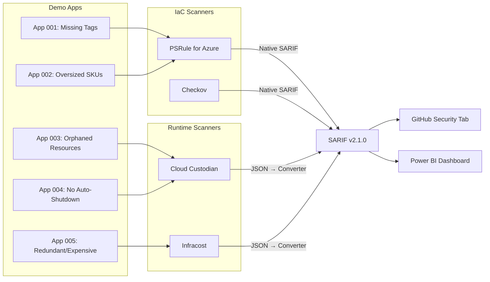
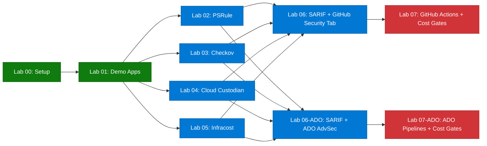

  

# FinOps Cost Governance Workshop

Welcome to the **FinOps Cost Governance Workshop** — a hands-on, progressive workshop that teaches you how to scan Azure infrastructure for cost governance violations using four open-source tools: PSRule, Checkov, Cloud Custodian, and Infracost.

All results are normalized to [SARIF v2.1.0](https://docs.oasis-open.org/sarif/sarif/v2.1.0/sarif-v2.1.0.html) for unified reporting in GitHub Advanced Security or Azure DevOps Advanced Security.

> [!NOTE]
> This workshop is part of the [Agentic Accelerator Framework](https://github.com/devopsabcs-engineering/agentic-accelerator-framework).

## Architecture

## Tool Stack

| Tool | Focus | SARIF Output | License |
|------|-------|-------------|---------|
| PSRule for Azure | WAF Cost Optimization rules on Bicep/ARM | Native | MIT |
| Checkov | 1,000+ multi-cloud IaC policies | Native | Apache 2.0 |
| Cloud Custodian | Orphans, tagging, right-sizing on live resources | Converted | Apache 2.0 |
| Infracost | Pre-deployment cost estimates | Converted | Apache 2.0 |

## Prerequisites

- **GitHub account** with access to create repositories
- **Azure subscription** (required for Labs 04, 05, 07; free tier works)
- **VS Code** with the Bicep and PowerShell extensions
- **Tools** (installed during Lab 00):
  - Azure CLI
  - GitHub CLI
  - PowerShell 7+
  - PSRule and PSRule.Rules.Azure module
  - Checkov (`pip install checkov`)
  - Cloud Custodian (`pip install c7n c7n-azure`)
  - Infracost CLI

See [Lab 00: Prerequisites](labs/lab-00-setup.md) for detailed installation instructions.

## Labs

| # | Lab | Duration | Level |
|---|-----|----------|-------|
| 00 | [Prerequisites](labs/lab-00-setup.md) | 30 min | Beginner |
| 01 | [Explore Demo Apps](labs/lab-01.md) | 25 min | Beginner |
| 02 | [PSRule](labs/lab-02.md) | 35 min | Intermediate |
| 03 | [Checkov](labs/lab-03.md) | 30 min | Intermediate |
| 04 | [Cloud Custodian](labs/lab-04.md) | 40 min | Intermediate |
| 05 | [Infracost](labs/lab-05.md) | 35 min | Intermediate |
| 06 | [SARIF + GitHub Security Tab](labs/lab-06.md) | 30 min | Intermediate |
| 06-ADO | [SARIF + ADO Advanced Security](labs/lab-06-ado.md) | 35 min | Intermediate |
| 07 | [GitHub Actions + Cost Gates](labs/lab-07.md) | 45 min | Advanced |
| 07-ADO | [ADO Pipelines + Cost Gates](labs/lab-07-ado.md) | 50 min | Advanced |

## Workshop Schedule

### Half-Day (3.5 hours)

| Time | Activity |
|------|----------|
| 0:00 – 0:30 | Lab 00: Prerequisites |
| 0:30 – 0:55 | Lab 01: Explore Demo Apps |
| 0:55 – 1:30 | Lab 02: PSRule |
| 1:30 – 2:00 | Lab 03: Checkov |
| 2:00 – 2:15 | Break |
| 2:15 – 2:45 | Lab 06: SARIF + GitHub Security Tab (or Lab 06-ADO) |

### Full-Day (7 hours)

| Time | Activity |
|------|----------|
| 0:00 – 0:30 | Lab 00: Prerequisites |
| 0:30 – 0:55 | Lab 01: Explore Demo Apps |
| 0:55 – 1:30 | Lab 02: PSRule |
| 1:30 – 2:00 | Lab 03: Checkov |
| 2:00 – 2:40 | Lab 04: Cloud Custodian |
| 2:40 – 2:55 | Break |
| 2:55 – 3:30 | Lab 05: Infracost |
| 3:30 – 4:00 | Lab 06: SARIF + GitHub Security Tab |
| 4:00 – 4:35 | Lab 06-ADO: SARIF + ADO Advanced Security |
| 4:35 – 4:50 | Break |
| 4:50 – 5:35 | Lab 07: GitHub Actions + Cost Gates |
| 5:35 – 6:25 | Lab 07-ADO: ADO Pipelines + Cost Gates |

## Lab Dependency Diagram

## Delivery Tiers

| Tier | Platform | Labs | Duration | Azure Required |
|------|----------|------|----------|---------------|
| Half-Day (GitHub) | GitHub | 00, 01, 02, 03, 06 | ~3.5 hours | No |
| Half-Day (ADO) | ADO | 00, 01, 02, 03, 06-ADO | ~3.5 hours | No |
| Full-Day (GitHub) | GitHub | 00–07 (all GitHub) | ~7.25 hours | Yes |
| Full-Day (ADO) | ADO | 00–05, 06-ADO, 07-ADO | ~7.75 hours | Yes |
| Full-Day (Dual) | Both | 00–05, 06, 06-ADO, 07, 07-ADO | ~9.25 hours | Yes |

## Getting Started

1. **Fork or use this template** to create your own workshop instance.
2. Complete [Lab 00: Prerequisites](labs/lab-00-setup.md) to set up your environment.
3. Work through the labs in order — each lab builds on the previous one.

> **Tip**: This workshop is designed for GitHub Codespaces. Click **Code → Codespaces → New codespace** to get a pre-configured environment with all tools installed.

## License

This project is licensed under the [MIT License](LICENSE).
