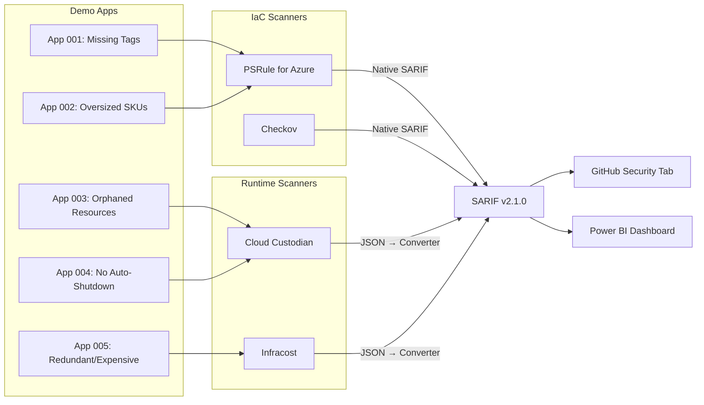
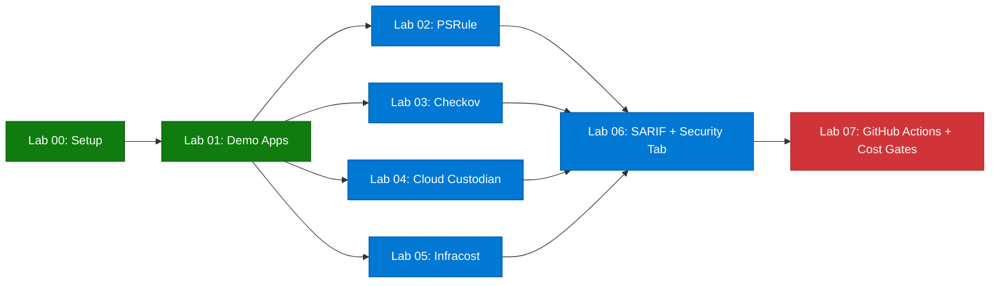

# FinOps Cost Governance Workshop

> [!NOTE]
> This workshop is part of the [Agentic Accelerator Framework](https://github.com/devopsabcs-engineering/agentic-accelerator-framework).

Learn to scan Azure infrastructure for cost governance violations using four open-source tools—PSRule, Checkov, Cloud Custodian, and Infracost—producing SARIF output for GitHub Security tab integration.

## Architecture

## Tool Stack

| Tool | Focus | SARIF Output | License |
|------|-------|-------------|---------|
| PSRule for Azure | WAF Cost Optimization rules on Bicep/ARM | Native | MIT |
| Checkov | 1,000+ multi-cloud IaC policies | Native | Apache 2.0 |
| Cloud Custodian | Orphans, tagging, right-sizing on live resources | Converted | Apache 2.0 |
| Infracost | Pre-deployment cost estimates | Converted | Apache 2.0 |

## Labs

Work through the labs in order. Labs 02–05 can be completed in parallel after Lab 01.

- [ ] [Lab 00 — Prerequisites and Environment Setup](labs/lab-00-setup.md) _(30 min, Beginner)_
- [ ] [Lab 01 — Explore the Demo Apps and FinOps Violations](labs/lab-01.md) _(25 min, Beginner)_
- [ ] [Lab 02 — PSRule: Infrastructure as Code Analysis](labs/lab-02.md) _(35 min, Intermediate)_
- [ ] [Lab 03 — Checkov: Static Policy Scanning](labs/lab-03.md) _(30 min, Intermediate)_
- [ ] [Lab 04 — Cloud Custodian: Runtime Resource Scanning](labs/lab-04.md) _(40 min, Intermediate)_
- [ ] [Lab 05 — Infracost: Cost Estimation and Budgeting](labs/lab-05.md) _(35 min, Intermediate)_
- [ ] [Lab 06 — SARIF Output and GitHub Security Tab](labs/lab-06.md) _(30 min, Intermediate)_
- [ ] [Lab 07 — GitHub Actions Pipelines and Cost Gates](labs/lab-07.md) _(45 min, Advanced)_

## Lab Dependency Diagram

## Delivery Tiers

| Tier | Labs | Duration | Azure Required |
|------|------|----------|---------------|
| Half-Day | 00, 01, 02, 03, 06 | ~3.5 hours | No |
| Full-Day | 00–07 (all) | ~7.25 hours | Yes |

## Prerequisites

- **GitHub account** with access to create repositories
- **Azure subscription** (required for Labs 04, 05, 07; free tier works)
- **VS Code** with the Bicep and PowerShell extensions
- **Tools** (installed during Lab 00):
  - Azure CLI
  - GitHub CLI
  - PowerShell 7+
  - PSRule and PSRule.Rules.Azure module
  - Checkov (`pip install checkov`)
  - Cloud Custodian (`pip install c7n c7n-azure`)
  - Infracost CLI

## Getting Started

1. **Use this template** — Click [Use this template](https://github.com/devopsabcs-engineering/finops-scan-workshop/generate) to create your own copy.
2. **Install prerequisites** — Follow [Lab 00](labs/lab-00-setup.md) to set up your environment.
3. **Start scanning** — Work through the labs sequentially, beginning with [Lab 01](labs/lab-01.md).

## License

This project is licensed under the [MIT License](LICENSE).
