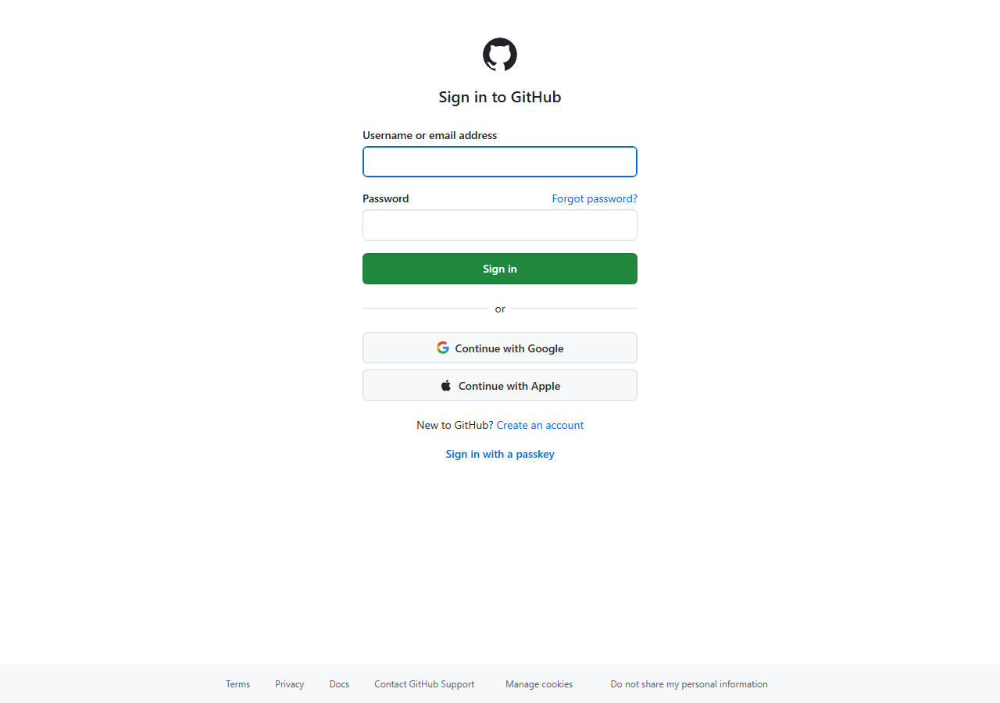
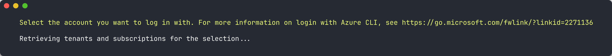
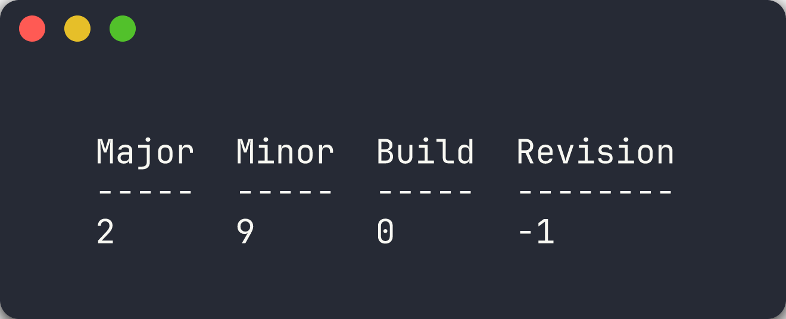
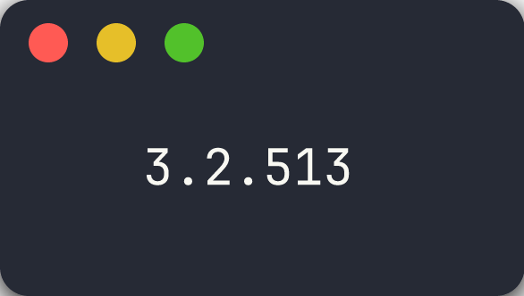
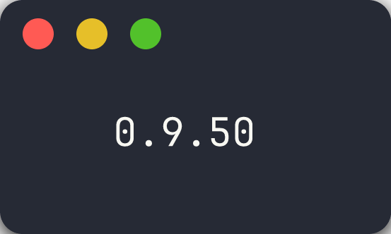
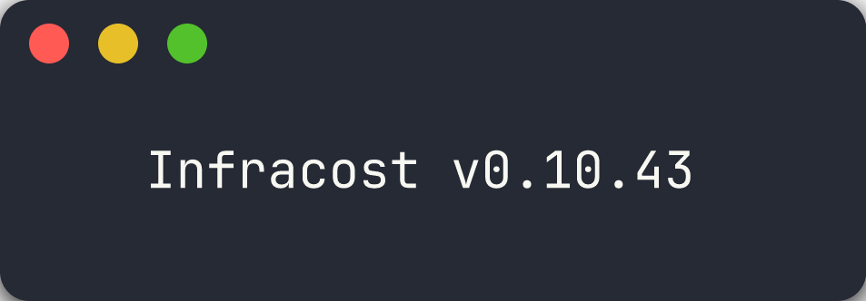
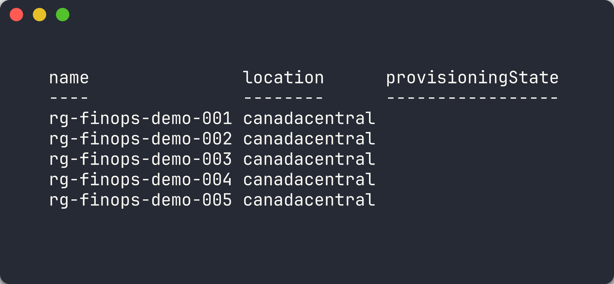

## Overview

| | |
|---|---|
| **Duration** | 30 minutes |
| **Level** | Beginner |
| **Prerequisites** | None |

> [!IMPORTANT]
> This lab requires an Azure subscription with **Contributor** access and a GitHub account. You will deploy resources that incur costs. Remember to tear down demo resources after the workshop.

## Learning Objectives

By the end of this lab, you will be able to:

* Fork and clone the `finops-scan-demo-app` repository
* Install the 4 required scanner tools (PSRule, Checkov, Cloud Custodian, Infracost)
* Authenticate with Azure using the Azure CLI
* Verify all tool installations with version checks
* Deploy the 5 demo apps to your Azure subscription

## Exercises

### Exercise 0.1: Fork the Repository

You will fork the workshop's source repository so you have your own copy to scan and modify.

1. Open a terminal (PowerShell or bash).
2. Fork and clone the repository using the GitHub CLI:

   ```bash
   gh repo fork devopsabcs-engineering/finops-scan-demo-app --clone
   ```

3. Change into the cloned directory:

   ```bash
   cd finops-scan-demo-app
   ```

4. Verify the remote points to your fork:

   ```bash
   git remote -v
   ```

   You should see your GitHub username in the `origin` URL.

> [!TIP]
> If you do not have the GitHub CLI installed, run `winget install GitHub.cli` on Windows or `brew install gh` on macOS first.



### Exercise 0.2: Install Scanner Tools

You will install the 4 scanner tools used throughout the workshop.

1. **PSRule for Azure** — Install the PowerShell module:

   ```powershell
   Install-Module PSRule.Rules.Azure -Scope CurrentUser -Force
   ```

2. **Checkov** — Install via pip:

   ```bash
   pip install checkov
   ```

3. **Cloud Custodian** — Install the core package and Azure provider:

   ```bash
   pip install c7n c7n-azure
   ```

4. **Infracost** — Install the CLI:

   ```powershell
   # Windows
   choco install infracost
   # or download from https://www.infracost.io/docs/#quick-start
   ```

   ```bash
   # macOS / Linux
   brew install infracost
   ```

5. **Azure CLI** — If not already installed:

   ```powershell
   winget install Microsoft.AzureCLI
   ```

> [!TIP]
> Use a Python virtual environment to keep Checkov and Cloud Custodian dependencies isolated: `python -m venv .venv && .venv/Scripts/Activate.ps1` (PowerShell) or `source .venv/bin/activate` (bash).

### Exercise 0.3: Azure Authentication

You will authenticate with Azure so the scanners can access your subscription.

1. Sign in to Azure:

   ```bash
   az login
   ```

2. If you have multiple subscriptions, set the target subscription:

   ```bash
   az account set --subscription "<your-subscription-name-or-id>"
   ```

3. Verify you are authenticated with the correct subscription:

   ```bash
   az account show --output table
   ```

   Confirm the `Name` and `SubscriptionId` match your intended target.



### Exercise 0.4: Tool Verification

You will run version checks to confirm every tool is installed correctly.

1. **GitHub CLI:**

   ```bash
   gh --version
   ```

   

2. **PSRule:**

   ```powershell
   Get-Module PSRule.Rules.Azure -ListAvailable | Select-Object Name, Version
   ```

   

3. **Checkov:**

   ```bash
   checkov --version
   ```

   

4. **Cloud Custodian:**

   ```bash
   custodian version
   ```

   

5. **Infracost:**

   ```bash
   infracost --version
   ```

   

> [!CAUTION]
> If any tool fails the version check, resolve the installation issue before proceeding. Later labs depend on all 4 scanners being available.

### Exercise 0.5: Deploy Demo Apps

You will deploy the 5 demo apps to Azure so the scanners have real resources to analyse.

**Option A — Automated Deployment (Recommended)**

1. Run the bootstrap script from the repository root:

   ```powershell
   ./scripts/bootstrap-demo-apps.ps1
   ```

   The script creates 5 resource groups (`rg-finops-demo-001` through `rg-finops-demo-005`) and deploys each app's Bicep template.

   

**Option B — Manual Single-App Deployment**

1. Create the resource group for app 001:

   ```bash
   az group create --name rg-finops-demo-001 --location canadacentral
   ```

2. Deploy the Bicep template:

   ```bash
   az deployment group create \
     --resource-group rg-finops-demo-001 \
     --template-file finops-demo-app-001/infra/main.bicep
   ```

3. Repeat for additional apps as needed during later labs.

> [!IMPORTANT]
> The demo apps intentionally deploy resources with FinOps violations. These resources incur real Azure costs. Run the teardown script after completing the workshop: `./scripts/teardown-all.ps1`.

## Verification Checkpoint

Before proceeding, verify:

* [ ] Repository forked and cloned locally
* [ ] All 4 scanner tools installed and returning version output
* [ ] Azure CLI authenticated with the correct subscription
* [ ] At least `finops-demo-app-001` deployed to Azure

## Next Steps

Proceed to [Lab 01 — Explore the Demo Apps and FinOps Violations](lab-01.md).
