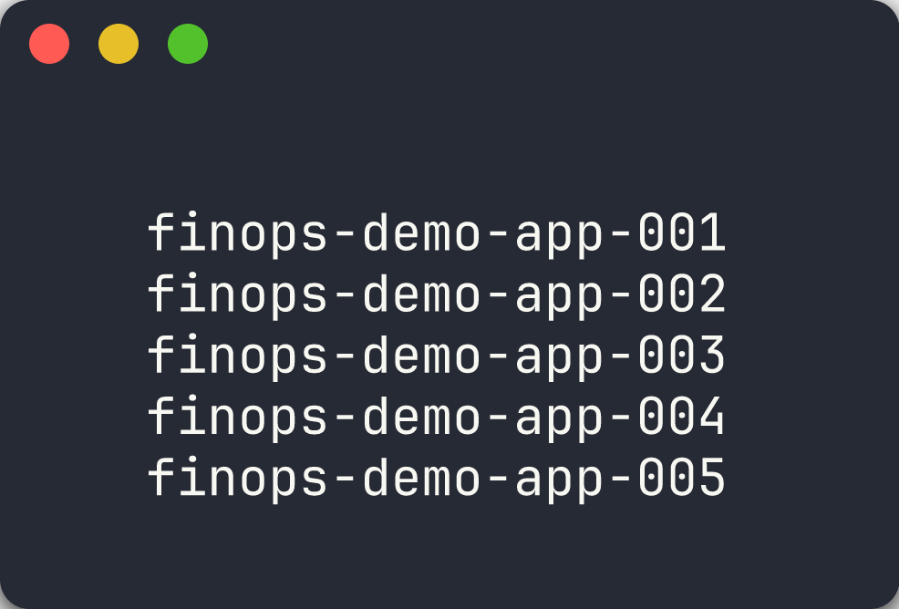
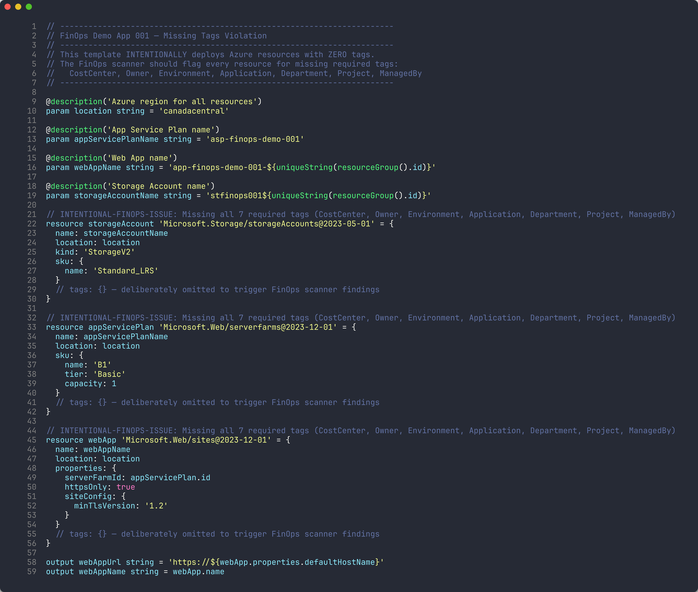
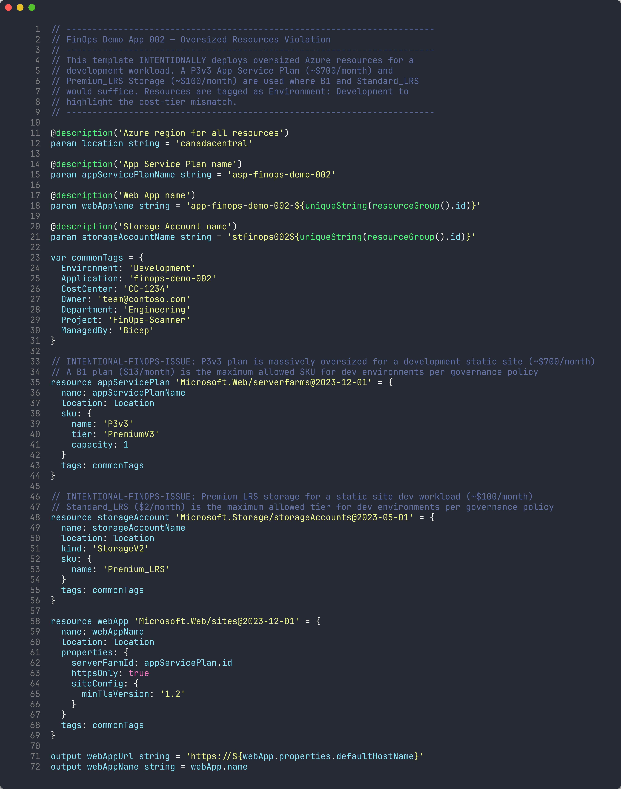
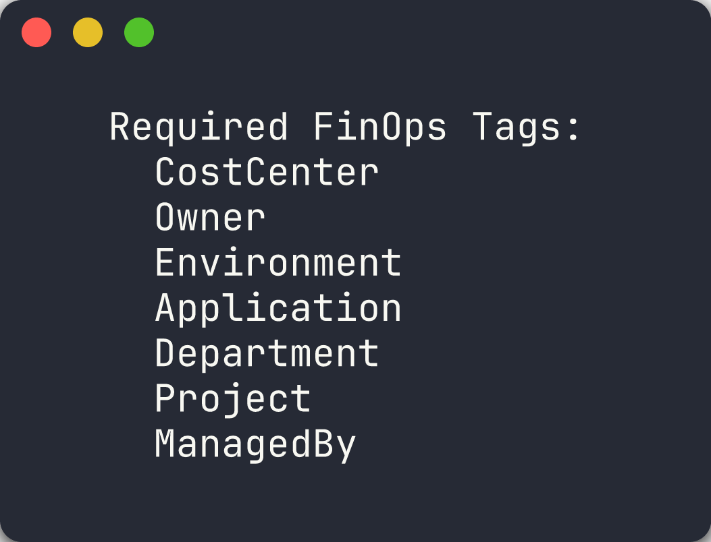
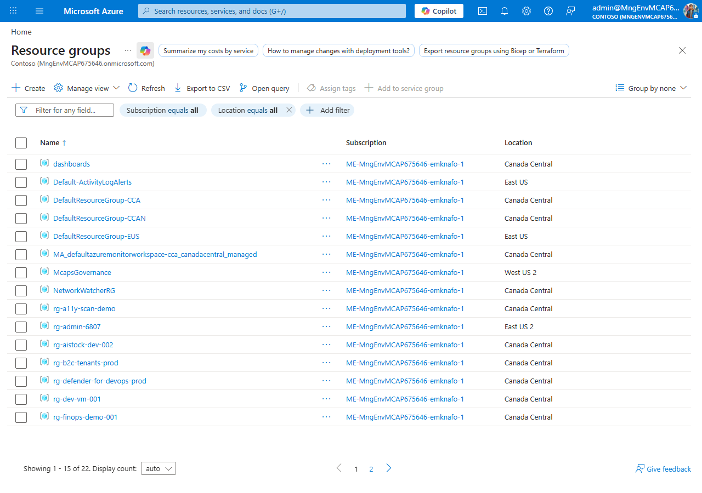
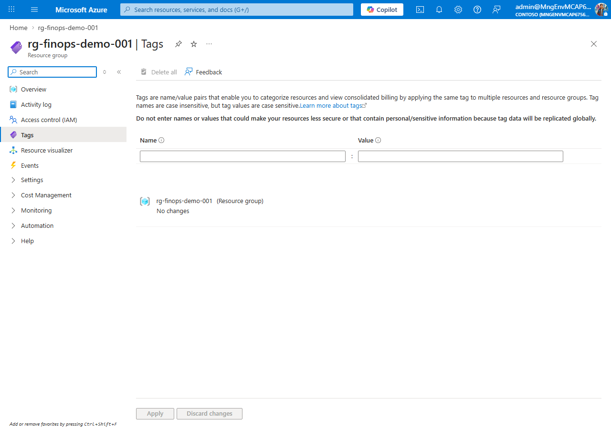

## Overview

| | |
|---|---|
| **Duration** | 25 minutes |
| **Level** | Beginner |
| **Prerequisites** | [Lab 00](lab-00-setup.md) |

## Learning Objectives

By the end of this lab, you will be able to:

* Describe the 5 demo apps and their intentional FinOps violations
* Read Bicep templates and identify cost governance issues visually
* Explain the 7 required governance tags and their format rules
* Navigate the Azure Portal to view deployed resources and inspect their tags

## Exercises

### Exercise 1.1: Review Demo App Matrix

Each demo app is designed to trigger a specific category of FinOps cost governance violation. You will review the full matrix to understand what the scanners will detect.

1. Open the table below and study each app's violation type, key resources, and estimated monthly waste:

   | App | Violation | Key Resources | Monthly Waste Est. |
   |-----|-----------|---------------|--------------------|
   | 001 | Missing all 7 required tags | Storage Account + App Service Plan + Web App | Compliance risk |
   | 002 | Oversized resources for dev workload | P3v3 App Service Plan + Premium Storage | ~$800/month |
   | 003 | Orphaned resources (unattached) | Public IP + NIC + Managed Disk + NSG | ~$25/month |
   | 004 | No auto-shutdown on VM | D4s_v5 Virtual Machine running 24/7 | ~$100/month |
   | 005 | Redundant/expensive configuration | 2× S3 App Service Plans in non-approved regions + GRS Storage | ~$450/month |

2. Note how violations fall into distinct categories: **tagging**, **right-sizing**, **orphaned resources**, **scheduling**, and **redundancy**.

3. Consider which scanner tool is best suited for each violation type. You will validate your predictions in Labs 02-05.



### Exercise 1.2: Read Bicep Templates

You will open Bicep templates to identify cost governance issues directly in the infrastructure code.

**App 001 — Missing Tags**

1. Open `finops-demo-app-001/infra/main.bicep` in VS Code.
2. Scroll through the three resource definitions: `storageAccount`, `appServicePlan`, and `webApp`.
3. Notice that **none** of the resources have a `tags` property. Comments in the code confirm this is intentional:

   ```bicep
   // tags: {} — deliberately omitted to trigger FinOps scanner findings
   ```

4. Count the number of resources affected — you should find **3 resources** with zero tags.



**App 002 — Oversized Resources**

5. Open `finops-demo-app-002/infra/main.bicep`.
6. Find the App Service Plan resource and note the SKU:

   ```bicep
   sku: {
     name: 'P3v3'
     tier: 'PremiumV3'
     capacity: 1
   }
   ```

7. Compare this against the governance policy: **dev environments allow a maximum of B1** (see the SKU Governance table below).

   | Environment | Max App Service Plan | Max VM Size | Max Storage Tier |
   |-------------|----------------------|-------------|------------------|
   | dev | B1 | Standard_B2s | Standard_LRS |
   | staging | S1 | Standard_D2s_v5 | Standard_LRS |
   | prod | P1v3 | Standard_D4s_v5 | Standard_GRS |

8. The `commonTags` variable shows `Environment: 'Development'`, confirming this is a dev workload using a production-tier plan.



### Exercise 1.3: Governance Tag Checklist

Every Azure resource must include the following 7 tags. You will use this checklist throughout the workshop to evaluate scanner findings.

1. Review the required tags table:

   | # | Tag Name | Purpose | Example Values |
   |---|----------|---------|----------------|
   | 1 | `CostCenter` | Financial cost center for chargeback | `CC-1234`, `CC-5678` |
   | 2 | `Owner` | Resource owner contact | `team@contoso.com` |
   | 3 | `Environment` | Deployment environment | `dev`, `staging`, `prod` |
   | 4 | `Application` | Application identifier | `finops-demo-001` |
   | 5 | `Department` | Organizational department | `Engineering`, `Finance` |
   | 6 | `Project` | Project name or code | `FinOps-Scanner` |
   | 7 | `ManagedBy` | Management mechanism | `Bicep`, `Terraform`, `Manual` |

2. Note the format rules:
   - Tag names use **PascalCase**
   - Tag values must not be empty strings
   - `Environment` must be one of: `dev`, `staging`, `prod`, `shared`
   - `Owner` must be a valid email address
   - `CostCenter` must match pattern `CC-\d{4,6}`

3. Open `finops-demo-app-001/infra/main.bicep` again and confirm that **zero** of the 7 tags are present on any resource.

4. Open `finops-demo-app-002/infra/main.bicep` and verify that all 7 tags **are** present in the `commonTags` variable.



> [!TIP]
> App 001 is the worst offender for tagging compliance. Apps 002-005 all include tags but violate other governance policies (sizing, orphans, scheduling, redundancy).

### Exercise 1.4: Azure Portal Exploration

You will view the deployed resources in the Azure Portal to see how violations appear at runtime.

1. Open the [Azure Portal](https://portal.azure.com) and navigate to **Resource groups**.
2. Search for `rg-finops-demo-001` and open it.
3. Select any resource (for example, the Storage Account) and click **Tags** in the left menu.
4. Confirm the tags panel is empty — no tags applied.

   

5. Navigate to `rg-finops-demo-002` and open the App Service Plan.
6. Check the **Pricing tier** — it should show **P3v3**.
7. Click **Tags** and confirm all 7 governance tags are present, but the tier is oversized for a `Development` environment.

   

> [!IMPORTANT]
> If resource groups are missing, return to Lab 00, Exercise 0.5 and deploy the demo apps before continuing.

## Verification Checkpoint

Before proceeding, verify:

* [ ] Can name all 5 violation categories (missing tags, oversized, orphaned, no auto-shutdown, redundant)
* [ ] Can identify at least 3 violations by reading Bicep `main.bicep` files
* [ ] Can list the 7 required governance tags from memory
* [ ] Viewed at least one resource group in the Azure Portal

## Next Steps

Proceed to [Lab 02 — PSRule: Infrastructure as Code Analysis](lab-02.md).
