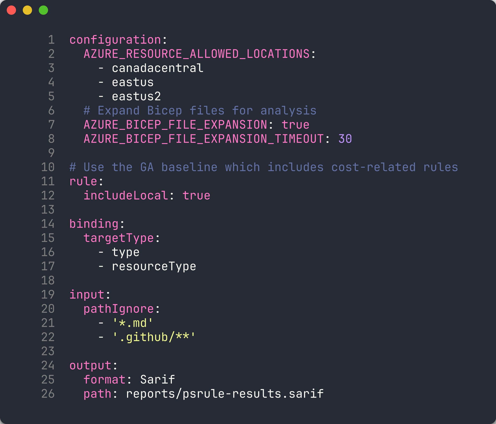
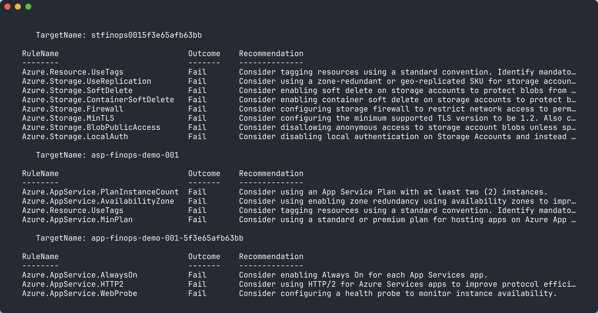
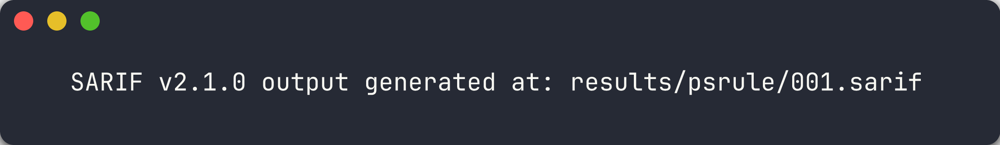
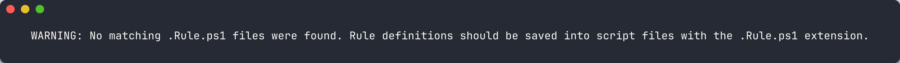
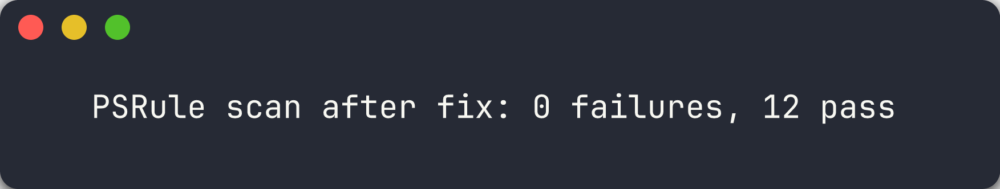

## Overview

| | |
|---|---|
| **Duration** | 35 minutes |
| **Level** | Intermediate |
| **Prerequisites** | [Lab 01](lab-01.md) |

## Learning Objectives

By the end of this lab, you will be able to:

* Configure PSRule with `ps-rule.yaml` for Azure Bicep analysis
* Run PSRule locally using `Invoke-PSRule` with the Azure.GA baseline
* Interpret PSRule SARIF output to identify tag and SKU violations
* Understand PSRule rule categories for cost governance

## Exercises

### Exercise 2.1: Review PSRule Configuration

You will examine the PSRule configuration file that controls how Bicep templates are analysed.

1. Open `src/config/ps-rule.yaml` in VS Code.
2. Review the configuration:

   ```yaml
   configuration:
     AZURE_RESOURCE_ALLOWED_LOCATIONS:
       - canadacentral
       - eastus
       - eastus2
     # Expand Bicep files for analysis
     AZURE_BICEP_FILE_EXPANSION: true
     AZURE_BICEP_FILE_EXPANSION_TIMEOUT: 30

   # Use the GA baseline which includes cost-related rules
   rule:
     includeLocal: true

   binding:
     targetType:
       - type
       - resourceType

   input:
     pathIgnore:
       - '*.md'
       - '.github/**'

   output:
     format: Sarif
     path: reports/psrule-results.sarif
   ```

3. Note the key settings:
   - **`AZURE_BICEP_FILE_EXPANSION: true`** — PSRule expands Bicep files into ARM JSON before scanning, enabling deeper analysis.
   - **`AZURE_RESOURCE_ALLOWED_LOCATIONS`** — restricts resources to `canadacentral`, `eastus`, and `eastus2`. Resources in other regions are flagged.
   - **`output.format: Sarif`** — results are written in SARIF format for GitHub Security Tab integration.



> [!TIP]
> The `Azure.GA_2024_12` baseline includes rules for resource tagging, naming, SKU sizing, and security. You can view the full rule list with `Get-PSRule -Module PSRule.Rules.Azure -Baseline Azure.GA_2024_12`.

### Exercise 2.2: Scan App 001

You will run PSRule against the missing-tags app to generate your first set of findings.

1. Create a reports directory:

   ```powershell
   New-Item -ItemType Directory -Path reports -Force
   ```

2. Run PSRule against app 001:

   ```powershell
   Invoke-PSRule `
     -InputPath finops-demo-app-001/infra/ `
     -Module PSRule.Rules.Azure `
     -Baseline Azure.GA_2024_12 `
     -Option src/config/ps-rule.yaml `
     -OutputFormat Sarif `
     -OutputPath reports/psrule-001.sarif
   ```

3. Review the console output. You should see multiple **Fail** results related to missing tags.



> [!TIP]
> To see results in a table on the console without writing to file, omit the `-OutputFormat` and `-OutputPath` parameters.

### Exercise 2.3: Analyze Results

You will open the SARIF file and understand the structure of PSRule findings.

1. Open `reports/psrule-001.sarif` in VS Code (install the **SARIF Viewer** extension for a richer experience).

2. Locate the `results` array. Each result contains:
   - **`ruleId`** — the PSRule rule that was violated (for example, `Azure.Resource.UseTags`)
   - **`level`** — severity: `error`, `warning`, or `note`
   - **`message.text`** — human-readable description of the violation
   - **`locations`** — the resource name and type that failed the rule

3. Identify the findings. Common rule IDs for cost governance include:

   | Rule ID | Category | Description |
   |---------|----------|-------------|
   | `Azure.Resource.UseTags` | Tagging | Resources should have tags |
   | `Azure.Resource.AllowedRegions` | Location | Resources in non-approved region |

4. Count the total number of findings. App 001 has 3 resources with no tags, so you should see at least 3 tagging-related findings.



### Exercise 2.4: Scan App 002

You will scan the oversized resources app and compare the results with app 001.

1. Run PSRule against app 002:

   ```powershell
   Invoke-PSRule `
     -InputPath finops-demo-app-002/infra/ `
     -Module PSRule.Rules.Azure `
     -Baseline Azure.GA_2024_12 `
     -Option src/config/ps-rule.yaml `
     -OutputFormat Sarif `
     -OutputPath reports/psrule-002.sarif
   ```

2. Review the console output. App 002 **has** all 7 required tags, so tagging rules should pass.

3. Look for findings related to **SKU sizing** or **tier governance**. The P3v3 App Service Plan and Premium storage may trigger rules depending on the baseline.

4. Compare the finding count between apps 001 and 002:

   | App | Tag Findings | SKU Findings | Total |
   |-----|-------------|--------------|-------|
   | 001 | Multiple | 0 | High |
   | 002 | 0 | Varies | Lower |



> [!TIP]
> PSRule focuses primarily on IaC best practices. For runtime cost analysis (actual spend, right-sizing recommendations), you will use Cloud Custodian in Lab 04 and Infracost in Lab 05.

### Exercise 2.5: Fix and Re-scan

You will fix the tagging violation in app 001 and observe the reduced findings.

1. Open `finops-demo-app-001/infra/main.bicep`.

2. Add a `commonTags` variable after the parameter declarations:

   ```bicep
   var commonTags = {
     CostCenter: 'CC-1234'
     Owner: 'team@contoso.com'
     Environment: 'dev'
     Application: 'finops-demo-001'
     Department: 'Engineering'
     Project: 'FinOps-Scanner'
     ManagedBy: 'Bicep'
   }
   ```

3. Add `tags: commonTags` to each resource. For example, the Storage Account becomes:

   ```bicep
   resource storageAccount 'Microsoft.Storage/storageAccounts@2023-05-01' = {
     name: storageAccountName
     location: location
     kind: 'StorageV2'
     sku: {
       name: 'Standard_LRS'
     }
     tags: commonTags
   }
   ```

4. Repeat for the `appServicePlan` and `webApp` resources.

5. Re-run the PSRule scan:

   ```powershell
   Invoke-PSRule `
     -InputPath finops-demo-app-001/infra/ `
     -Module PSRule.Rules.Azure `
     -Baseline Azure.GA_2024_12 `
     -Option src/config/ps-rule.yaml `
     -OutputFormat Sarif `
     -OutputPath reports/psrule-001-fixed.sarif
   ```

6. Compare the new results with the original scan. The tagging findings should be eliminated.



> [!CAUTION]
> Do **not** commit the fixed Bicep file if you want the violation to remain for later labs. Use `git checkout -- finops-demo-app-001/infra/main.bicep` to revert your changes.

## Verification Checkpoint

Before proceeding, verify:

* [ ] PSRule scan completed successfully against at least 2 demo apps
* [ ] SARIF output files generated in the `reports/` directory
* [ ] Can explain what `Azure.Resource.UseTags` detects
* [ ] Successfully remediated at least 1 finding by adding tags to Bicep

## Next Steps

Proceed to [Lab 03 — Checkov: Static Policy Scanning](lab-03.md).
