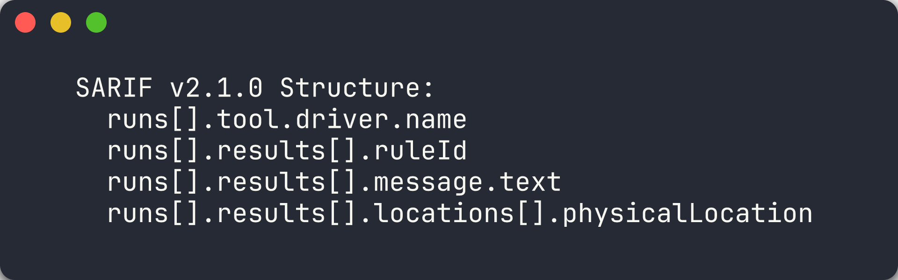
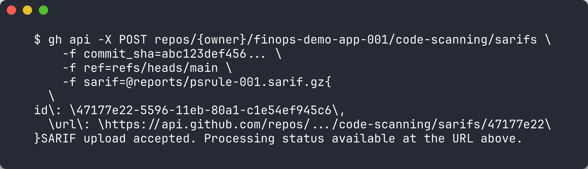
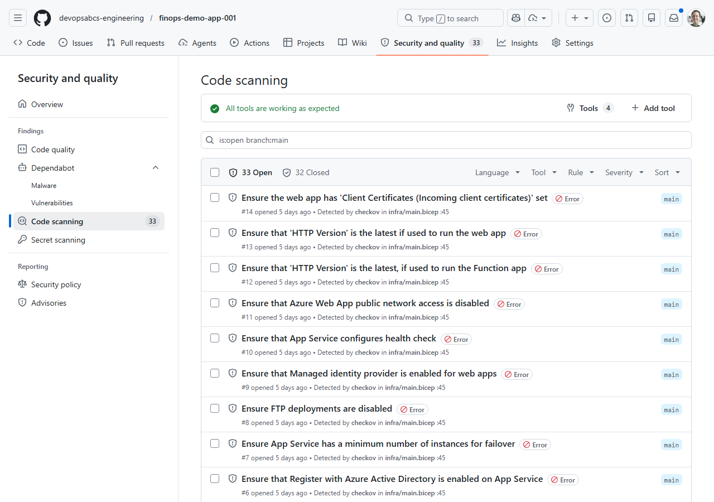
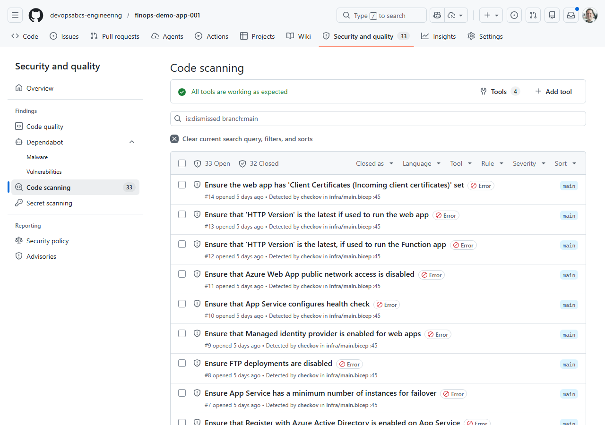
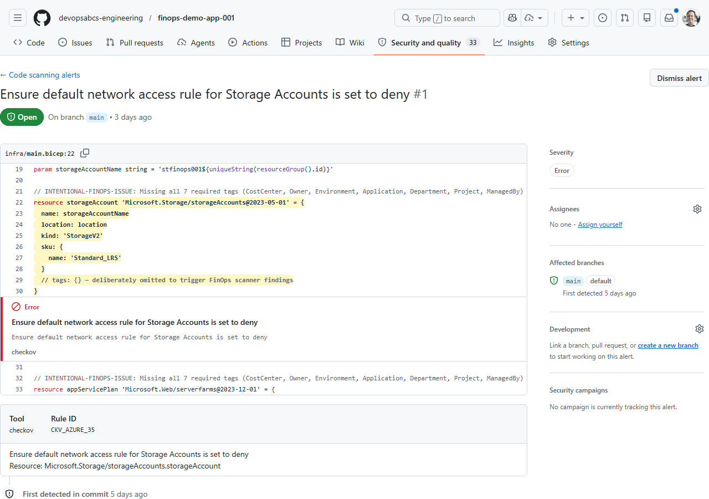

## Overview

| | |
|---|---|
| **Duration** | 30 minutes |
| **Level** | Intermediate |
| **Prerequisites** | [Lab 02](lab-02.md), [Lab 03](lab-03.md), [Lab 04](lab-04.md), or [Lab 05](lab-05.md) (at least one) |

> [!TIP]
> **Using Azure DevOps?** See [Lab 06-ADO — SARIF Output and ADO Advanced Security](lab-06-ado.md) for the ADO variant of this lab.

## Learning Objectives

By the end of this lab, you will be able to:

* Explain the SARIF v2.1.0 schema including runs, tool, rules, results, and locations
* Upload SARIF results to GitHub Code Scanning via the REST API
* Navigate the GitHub Security tab to view FinOps alerts
* Filter, triage, and dismiss alerts in the Security tab

## Exercises

### Exercise 6.1: SARIF Schema Deep-Dive

You will examine the SARIF v2.1.0 format that all four scanner tools produce.

1. Open any SARIF file you generated in a previous lab (for example, `reports/psrule-001.sarif` or `reports/custodian.sarif`).

2. Review the top-level structure. Every SARIF file follows this schema:

   ```json
   {
     "version": "2.1.0",
     "$schema": "https://raw.githubusercontent.com/oasis-tcs/sarif-spec/main/sarif-2.1/schema/sarif-schema-2.1.0.json",
     "runs": [
       {
         "tool": {
           "driver": {
             "name": "CloudCustodian",
             "version": "1.0.0",
             "informationUri": "https://cloudcustodian.io",
             "rules": [
               {
                 "id": "check-required-tags",
                 "name": "check-required-tags",
                 "shortDescription": {
                   "text": "Cloud Custodian policy violation"
                 },
                 "defaultConfiguration": {
                   "level": "warning"
                 }
               }
             ]
           }
         },
         "results": [
           {
             "ruleId": "check-required-tags",
             "level": "warning",
             "message": {
               "text": "Resource rg-finops-demo-001 violates policy check-required-tags"
             },
             "locations": [
               {
                 "physicalLocation": {
                   "artifactLocation": {
                     "uri": "infra/main.bicep"
                   },
                   "region": {
                     "startLine": 1
                   }
                 }
               }
             ]
           }
         ]
       }
     ]
   }
   ```

3. Understand the four main sections:

   | Section | Purpose |
   |---------|---------|
   | `version` / `$schema` | Declares SARIF v2.1.0 compliance |
   | `runs[].tool.driver` | Identifies the scanner tool, version, and rule definitions |
   | `runs[].tool.driver.rules[]` | Defines rule IDs, descriptions, severity, and help URLs |
   | `runs[].results[]` | Contains individual findings with rule ID, severity, message, and location |

4. Note how `physicalLocation` ties a finding to a specific file and line number. GitHub Code Scanning uses this to annotate source files in pull requests.



> [!TIP]
> SARIF (Static Analysis Results Interchange Format) is an OASIS standard. GitHub, Azure DevOps, and many IDE extensions can consume SARIF files. By producing SARIF from all 4 tools, you get a unified view of FinOps violations across your entire scanning platform.

### Exercise 6.2: Upload SARIF Manually

You will upload a SARIF file to the GitHub Code Scanning API using the GitHub CLI.

1. Choose a SARIF file from a previous lab. This example uses the PSRule output for app 001:

   ```bash
   SARIF_FILE="reports/psrule-001.sarif"
   ```

2. Compress and base64-encode the SARIF file (required by the API):

   ```bash
   cat $SARIF_FILE | gzip | base64 > /tmp/sarif-base64.txt
   ```

   On Windows PowerShell:

   ```powershell
   $bytes = [System.IO.File]::ReadAllBytes("reports/psrule-001.sarif")
   $ms = New-Object System.IO.MemoryStream
   $gz = New-Object System.IO.Compression.GZipStream($ms, [System.IO.Compression.CompressionMode]::Compress)
   $gz.Write($bytes, 0, $bytes.Length)
   $gz.Close()
   $encoded = [Convert]::ToBase64String($ms.ToArray())
   $encoded | Out-File /tmp/sarif-base64.txt -NoNewline
   ```

3. Upload to the Code Scanning endpoint:

   ```bash
   gh api -X POST /repos/{owner}/{repo}/code-scanning/sarifs \
     -f "commit_sha=$(git rev-parse HEAD)" \
     -f "ref=refs/heads/main" \
     -f "sarif=$(cat /tmp/sarif-base64.txt)" \
     -f "tool_name=PSRule"
   ```

   Replace `{owner}` and `{repo}` with your fork's owner and repository name.

4. The API returns a response with a `url` field. You can poll this URL to check the processing status:

   ```bash
   gh api /repos/{owner}/{repo}/code-scanning/sarifs/{sarif_id}
   ```

5. Processing takes a few seconds. Once complete, the findings appear in the Security tab.



> [!IMPORTANT]
> The Code Scanning API requires the repository to have GitHub Advanced Security enabled. If you receive a 403 error, check that GHAS is enabled in your repository settings under **Settings → Code security and analysis**.

### Exercise 6.3: View Security Tab

You will navigate to the GitHub Security tab to view the uploaded FinOps alerts.

1. Open your repository on GitHub.

2. Click the **Security** tab in the top navigation bar.

3. Click **Code scanning** in the left sidebar.

4. You should see alerts from the SARIF file you uploaded. Each alert shows:
   - **Rule ID** — the scanner-specific rule identifier
   - **Severity** — error, warning, or note
   - **File** — the source file where the violation was detected
   - **Tool** — the scanner that produced the finding (PSRule, Checkov, Cloud Custodian, or Infracost)

5. Click on an individual alert to see the full detail view:
   - The finding description and remediation guidance
   - The source code location highlighted in the file
   - The SARIF rule metadata



> [!NOTE]
> If you uploaded SARIF from multiple tools, use the **Tool** filter to view findings from a specific scanner. This helps during triage when you want to focus on one category of violations at a time.

### Exercise 6.4: Triage Alerts

You will practise the triage workflow for FinOps alerts.

1. In the Code scanning alerts list, click on any alert.

2. Use the **Dismiss alert** dropdown to explore the triage options:
   - **False positive** — the alert does not apply to this resource
   - **Won't fix** — acknowledged but not worth addressing
   - **Used in tests** — the violation is intentional for testing purposes

3. Dismiss one alert as **Used in tests** (since these demo apps are intentionally misconfigured).

4. Use the filter controls to narrow the alert list:
   - Filter by **Tool** — show only PSRule, Checkov, or Cloud Custodian findings
   - Filter by **Severity** — show only errors, warnings, or notes
   - Filter by **State** — show open, dismissed, or fixed alerts

5. Mark one alert as **Closed** to simulate a remediation workflow. In practice, you would fix the Bicep template and re-scan to confirm the alert resolves.



> [!TIP]
> In a production FinOps programme, assign alert triage to specific team members. Use GitHub Code Scanning API webhooks to create automated notifications when new high-severity FinOps alerts appear.

### Exercise 6.5: Cross-Repo Upload

You will understand how the automated pipeline uploads SARIF to each demo app's repository.

1. Open `.github/workflows/finops-scan.yml` and find the `cross-repo-upload` job.

2. Review the job configuration:

   ```yaml
   cross-repo-upload:
     needs: [psrule-scan, checkov-scan, custodian-scan]
     if: always() && (needs.psrule-scan.result == 'success' || needs.checkov-scan.result == 'success')
     runs-on: ubuntu-latest
     strategy:
       matrix:
         app: ['001', '002', '003', '004', '005']
   ```

   The job runs after all three scan jobs complete and uses a matrix to process each demo app.

3. Understand the upload steps:
   - **Download artifacts** — fetches all SARIF files for the current app using `actions/download-artifact@v4` with a pattern match
   - **Upload SARIF** — iterates over each SARIF file and POSTs it to the target demo app repo's Code Scanning endpoint

4. The upload script compresses each SARIF file, looks up the latest commit SHA on the target repo's `main` branch, and calls the Code Scanning API — the same steps you performed manually in Exercise 6.2:

   ```bash
   SARIF_CONTENT=$(gzip -c "$sarif_file" | base64 -w0)
   COMMIT_SHA=$(gh api repos/{org}/finops-demo-app-{app}/commits/main --jq '.sha')
   gh api --method POST \
     repos/{org}/finops-demo-app-{app}/code-scanning/sarifs \
     -f "commit_sha=$COMMIT_SHA" \
     -f "ref=refs/heads/main" \
     -f "sarif=$SARIF_CONTENT"
   ```

5. This pattern pushes scan results from a centralised scanner repository **outward** to each individual app repository, so teams see FinOps alerts directly in their own Security tab.



> [!NOTE]
> The cross-repo upload requires an `ORG_ADMIN_TOKEN` secret with `security_events: write` permission on all target repositories. The `setup-oidc.ps1` script in Lab 07 does not cover this token — it must be created as a GitHub personal access token or fine-grained token.

## Verification Checkpoint

Before proceeding, verify:

* [ ] Can describe the 4 main SARIF sections (schema, runs, tool/rules, results)
* [ ] Successfully uploaded a SARIF file via `gh api`
* [ ] Viewed FinOps alerts in the GitHub Security tab
* [ ] Triaged at least 1 alert (dismissed or marked fixed)

## Next Steps

Proceed to [Lab 07 — GitHub Actions Pipelines and Cost Gates](lab-07.md).
