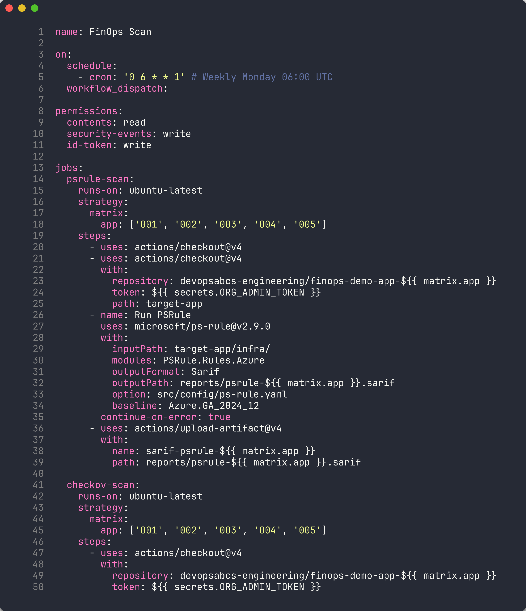
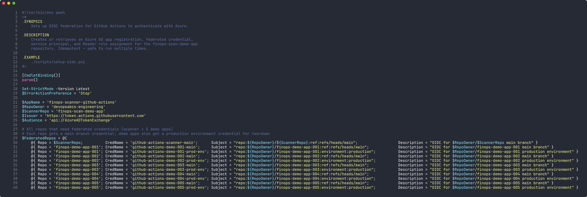
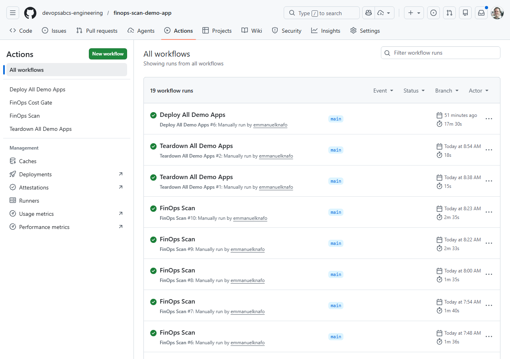
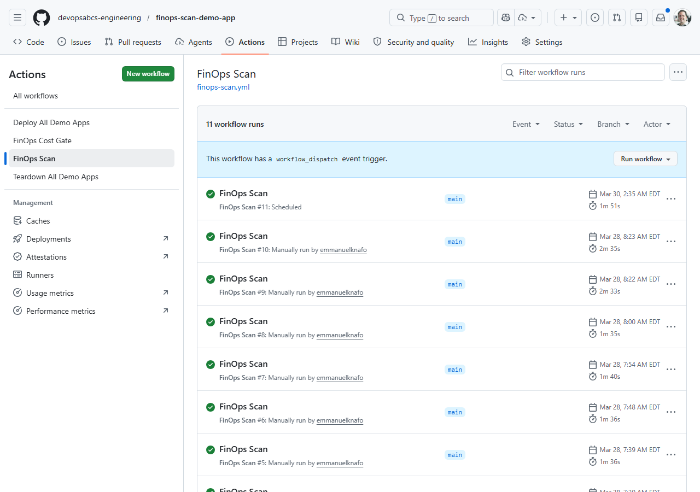
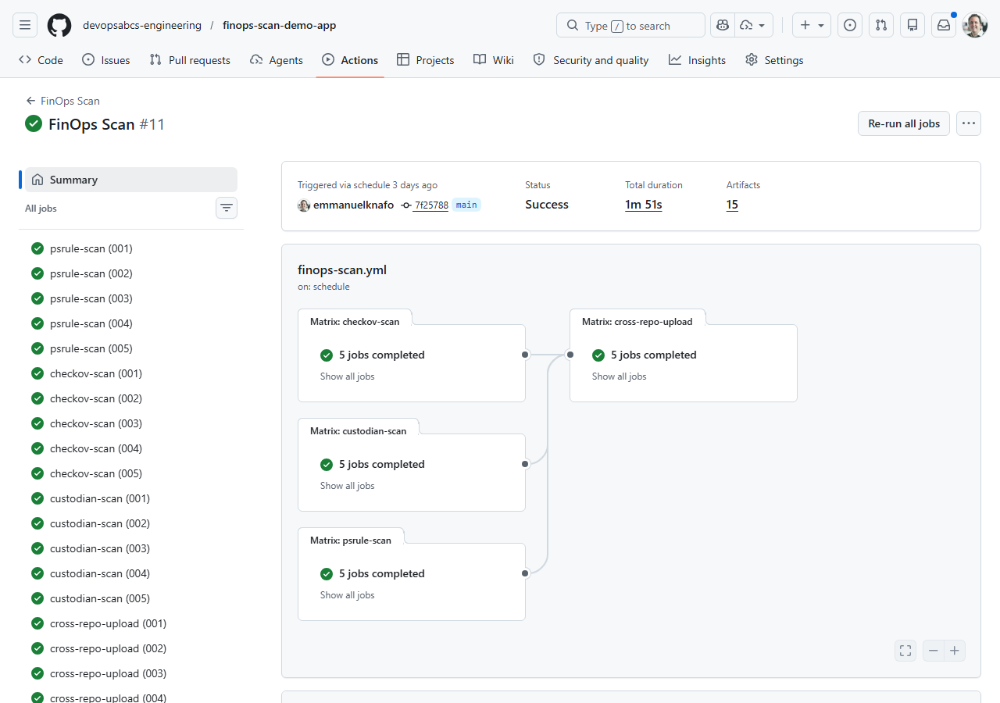
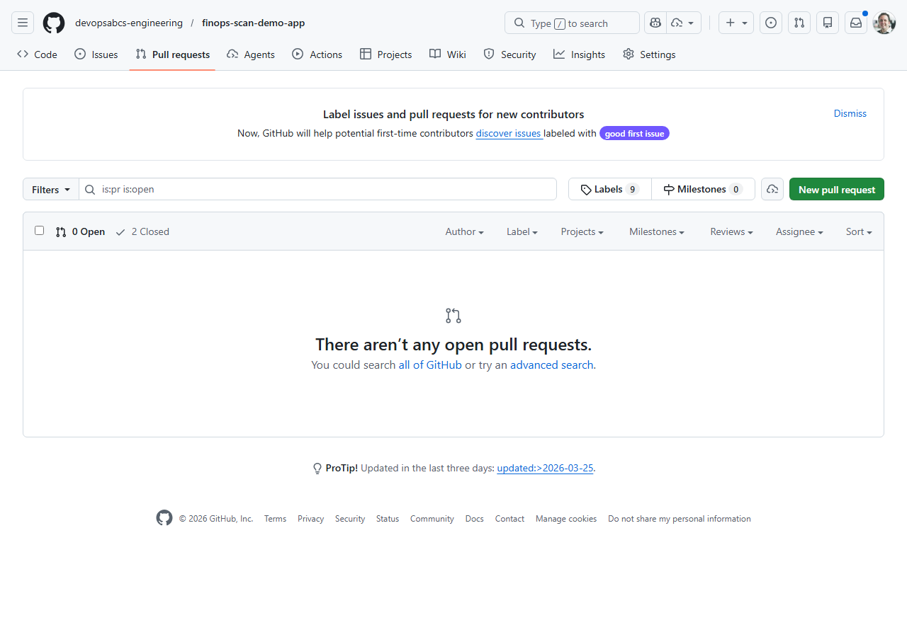
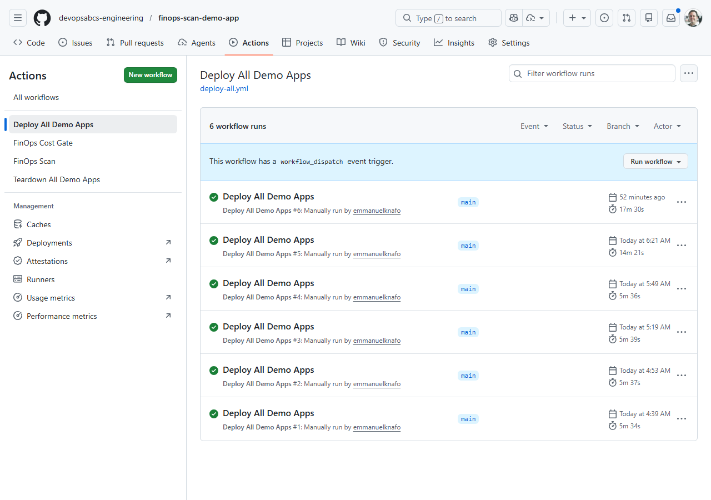

## Overview

| | |
|---|---|
| **Duration** | 45 minutes |
| **Level** | Advanced |
| **Prerequisites** | [Lab 02](lab-02.md), [Lab 03](lab-03.md), [Lab 04](lab-04.md), [Lab 05](lab-05.md), [Lab 06](lab-06.md) |

> [!TIP]
> **Using Azure DevOps?** See [Lab 07-ADO — ADO YAML Pipelines and Cost Gates](lab-07-ado.md) for the ADO variant of this lab.

## Learning Objectives

By the end of this lab, you will be able to:

* Build a GitHub Actions workflow with matrix strategy for multi-app scanning
* Configure OIDC authentication for Azure using workload identity federation
* Implement a PR cost gate workflow using Infracost
* Set up cross-repo SARIF upload via the GitHub Code Scanning API
* Trigger, monitor, and debug workflow runs

## Exercises

### Exercise 7.1: Review Scan Workflow

You will walk through the centralised scanning workflow that runs all 4 tools across all 5 demo apps.

1. Open `.github/workflows/finops-scan.yml` and review the overall architecture:

   ```text
   finops-scan.yml
   ├── psrule-scan (matrix: 5 apps)     → SARIF artifacts
   ├── checkov-scan (matrix: 5 apps)    → SARIF artifacts
   ├── custodian-scan (matrix: 5 apps)  → SARIF artifacts
   └── cross-repo-upload (matrix: 5 apps)
       └── Downloads all SARIF → uploads to each demo app's Security tab
   ```

2. Review the workflow triggers:

   ```yaml
   on:
     schedule:
       - cron: '0 6 * * 1'  # Weekly Monday 06:00 UTC
     workflow_dispatch:
   ```

   The workflow runs on a weekly schedule and can be triggered manually.

3. Review the permissions block:

   ```yaml
   permissions:
     contents: read
     security-events: write
     id-token: write
   ```

   - `contents: read` — checks out repository code
   - `security-events: write` — uploads SARIF to Code Scanning
   - `id-token: write` — requests OIDC tokens for Azure authentication

4. Review the matrix strategy used by each scan job:

   ```yaml
   strategy:
     matrix:
       app: ['001', '002', '003', '004', '005']
   ```

   This creates 5 parallel jobs — one for each demo app. Each job checks out the corresponding demo app repo and runs the scanner against it.

5. Review the `psrule-scan` job steps:
   - **Checkout scanner repo** — gets the PSRule configuration and SARIF converters
   - **Checkout target app** — clones the demo app repo into `target-app/`
   - **Run PSRule** — uses the `microsoft/ps-rule@v2.9.0` action with the `Azure.GA_2024_12` baseline
   - **Upload artifact** — saves the SARIF file as a build artifact for the cross-repo upload job

6. Review the `custodian-scan` job. Unlike PSRule and Checkov, Cloud Custodian:
   - Authenticates to Azure using OIDC (`azure/login@v2`)
   - Runs against **live resources** instead of IaC files
   - Uses `continue-on-error: true` to prevent scan failures from blocking the pipeline
   - Converts JSON output to SARIF using `custodian-to-sarif.py`

7. Review the `cross-repo-upload` job (covered in Lab 06, Exercise 6.5). Note how it depends on all three scan jobs and runs even if the custodian scan fails.



> [!TIP]
> The matrix strategy multiplies the number of jobs: 3 scanners × 5 apps = 15 scan jobs + 5 upload jobs = 20 total jobs. GitHub Actions runs matrix jobs in parallel, so the entire scan completes in the time of the slowest individual job.

### Exercise 7.2: OIDC Setup

You will configure Azure OIDC federation so GitHub Actions can authenticate without storing secrets.

1. Run the OIDC setup script:

   ```powershell
   ./scripts/setup-oidc.ps1
   ```

2. The script performs 5 steps:
   - **App registration** — creates or retrieves an Azure AD app named `finops-scanner-github-actions`
   - **Federated credentials** — creates OIDC credentials for each repo and branch combination
   - **Service principal** — creates or retrieves the service principal for the app
   - **Role assignment** — grants `Reader` role on the subscription
   - **Summary** — displays the Client ID, Tenant ID, and Subscription ID to configure as GitHub secrets

3. Review the federated credential subject format:

   ```text
   repo:devopsabcs-engineering/finops-scan-demo-app:ref:refs/heads/main
   repo:devopsabcs-engineering/finops-demo-app-001:environment:production
   ```

   Each credential maps a specific GitHub repository + branch (or environment) to the Azure AD app. This is the OIDC **subject claim** that Azure validates when issuing tokens.

4. After the script completes, add the following secrets to your GitHub repository settings:
   - `AZURE_CLIENT_ID` — the app registration's client ID
   - `AZURE_TENANT_ID` — your Azure AD tenant ID
   - `AZURE_SUBSCRIPTION_ID` — the target subscription ID



> [!IMPORTANT]
> OIDC federation eliminates the need for client secrets or certificates. The GitHub Actions runner requests a short-lived token from GitHub's OIDC provider, and Azure validates it against the federated credential configuration. No long-lived credentials are stored in GitHub Secrets.

### Exercise 7.3: Trigger Scan Workflow

You will trigger the scanning workflow manually and monitor its execution.

1. Trigger the workflow using the GitHub CLI:

   ```bash
   gh workflow run finops-scan.yml
   ```

2. Monitor the workflow run:

   ```bash
   gh run watch
   ```

   This opens an interactive view showing all matrix jobs and their progress.

3. Alternatively, open the repository on GitHub, click **Actions**, and select the **FinOps Scan** workflow to watch the run in the browser.

4. The workflow creates 20 jobs in total:
   - 5 PSRule scan jobs (one per app)
   - 5 Checkov scan jobs (one per app)
   - 5 Cloud Custodian scan jobs (one per app)
   - 5 cross-repo upload jobs (one per app)

5. Wait for the run to complete. PSRule and Checkov jobs typically finish in 1–2 minutes. Cloud Custodian jobs may take longer because they query live Azure resources.



> [!NOTE]
> If Cloud Custodian jobs fail with authentication errors, verify that your OIDC credentials are configured correctly (Exercise 7.2) and that the `AZURE_CLIENT_ID`, `AZURE_TENANT_ID`, and `AZURE_SUBSCRIPTION_ID` secrets are set in the repository settings.

### Exercise 7.4: Review Workflow Results

You will inspect the artifacts, SARIF uploads, and Security tab after the workflow completes.

1. List the workflow artifacts:

   ```bash
   gh run view --log
   ```

2. Download the SARIF artifacts for a specific app:

   ```bash
   gh run download -n sarif-psrule-001
   gh run download -n sarif-checkov-001
   gh run download -n sarif-custodian-001
   ```

3. Open the downloaded SARIF files and verify they contain findings.

4. Navigate to each demo app's repository on GitHub and check the **Security** tab. The cross-repo upload job should have populated Code Scanning alerts from all three scanners.

5. Compare the findings across tools:
   - **PSRule** — tags, naming, region, and Azure best practice violations
   - **Checkov** — security, encryption, and CIS benchmark violations
   - **Cloud Custodian** — runtime resource state (orphans, oversized, idle)





### Exercise 7.5: Cost Gate PR

You will create a pull request that changes infrastructure costs and observe the Infracost cost gate in action.

1. Create a new branch:

   ```bash
   git checkout -b test/cost-gate-demo
   ```

2. Open any demo app's `infra/main.bicep` and change a SKU to something more expensive. For example, upgrade app 001's App Service Plan:

   ```bicep
   sku: { name: 'P3v3', tier: 'PremiumV3' }
   ```

3. Commit and push the change:

   ```bash
   git add .
   git commit -m "test: upgrade SKU to trigger cost gate"
   git push -u origin test/cost-gate-demo
   ```

4. Create a pull request:

   ```bash
   gh pr create --title "test: upgrade SKU to trigger cost gate" --body "Testing Infracost cost gate workflow"
   ```

5. Wait for the `FinOps Cost Gate` workflow to run. It:
   - Generates a cost baseline from the `main` branch
   - Runs `infracost diff` against your PR changes
   - Posts a cost summary comment on the PR showing the monthly cost impact
   - Uploads a SARIF file with cost findings

6. Review the Infracost comment on the PR. It shows a table with resource-level cost changes and the total monthly impact.

7. Close the PR without merging (this was a test):

   ```bash
   gh pr close --delete-branch
   ```



> [!TIP]
> The cost gate workflow uses the `--behavior update` flag for the Infracost comment. This means each push to the PR branch updates the existing comment rather than creating a new one, keeping the PR conversation clean.

### Exercise 7.6: Deploy and Teardown

You will trigger the deploy-all and teardown-all workflows to understand the full lifecycle.

1. Trigger the deploy-all workflow:

   ```bash
   gh workflow run deploy-all.yml
   ```

2. Monitor the deployment:

   ```bash
   gh run watch
   ```

   The deploy-all workflow deploys all 5 demo apps sequentially. Each app deploys its Bicep template to a dedicated resource group (`rg-finops-demo-001` through `rg-finops-demo-005`).

3. After deployment completes, verify the resources in the Azure Portal or via the CLI:

   ```bash
   az group list --query "[?starts_with(name, 'rg-finops-demo')].[name, location]" -o table
   ```

4. Trigger the teardown-all workflow:

   ```bash
   gh workflow run teardown-all.yml
   ```

5. The teardown workflow requires **environment approval**. Navigate to the GitHub Actions page and approve the `production` environment deployment when prompted.

6. After approval, the workflow deletes all 5 resource groups and their contents.



> [!IMPORTANT]
> The teardown workflow uses a `production` environment with required reviewers as a safety gate. This prevents accidental deletion. In production FinOps workflows, always use environment protection rules for destructive operations.

## Verification Checkpoint

Before completing the workshop, verify:

* [ ] `finops-scan.yml` workflow ran successfully with matrix jobs
* [ ] SARIF artifacts uploaded to all 5 demo app repos' Security tabs
* [ ] Cost gate workflow posted an Infracost comment on a pull request
* [ ] Can explain the OIDC federated credential subject claim format

## Congratulations

You have completed all 8 labs in the FinOps Cost Governance Scanner Workshop. Here is a summary of what you learned:

| Lab | What You Learned |
|-----|------------------|
| **Lab 00** | Set up the development environment with all 4 scanner tools |
| **Lab 01** | Identified the 5 demo app FinOps violations and the 7 required governance tags |
| **Lab 02** | Ran PSRule against Bicep templates for Azure best practice analysis |
| **Lab 03** | Ran Checkov for security and CIS benchmark scanning |
| **Lab 04** | Ran Cloud Custodian against live Azure resources for runtime violation detection |
| **Lab 05** | Used Infracost to estimate costs and compare infrastructure changes |
| **Lab 06** | Understood the SARIF format and uploaded results to the GitHub Security tab |
| **Lab 07** | Built automated pipelines with matrix strategy, OIDC auth, and PR cost gates |

You now have the skills to implement a complete FinOps scanning platform that:

* **Scans IaC templates** before deployment (PSRule, Checkov, Infracost)
* **Scans live resources** after deployment (Cloud Custodian)
* **Produces unified SARIF output** for all tools
* **Integrates with GitHub Security tab** for centralised alert management
* **Blocks expensive changes** with PR cost gates
* **Runs automatically** on a schedule and on-demand via GitHub Actions
